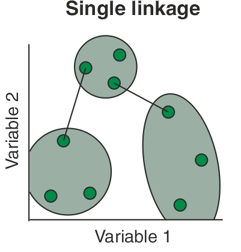
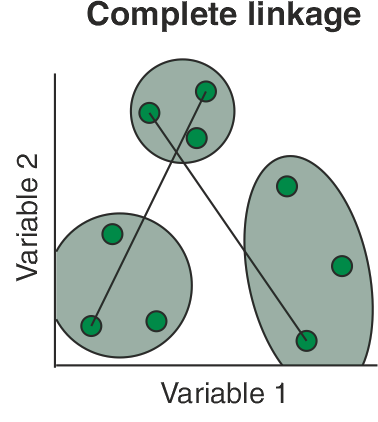
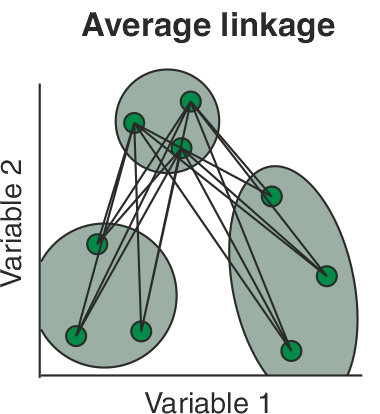
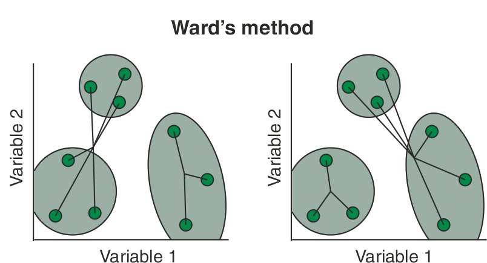
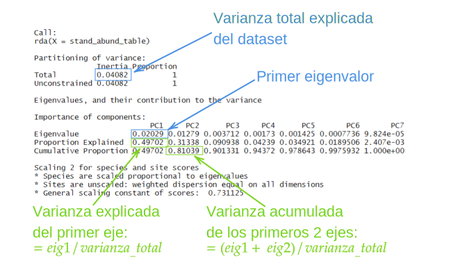

```{r setup, include = FALSE}
knitr::opts_chunk$set(echo = TRUE, warning = FALSE)
```


# Datos de Ratones y Humanos

## Conjuto de datos de ratón $Vdr^{-/-}$  

Los datos del microbioma intestinal murino ([Jin et al.2015](https://www.researchgate.net/profile/Jun-Sun-44/publication/277727880_Lack_of_Vitamin_D_Receptor_Causes_Dysbiosis_and_Changes_the_Functions_of_the_Murine_Intestinal_Microbiome/links/5746152408ae9ace84243769/Lack-of-Vitamin-D-Receptor-Causes-Dysbiosis-and-Changes-the-Functions-of-the-Murine-Intestinal-Microbiome.pdf) se obtuvieron de muestras de heces fecales y cecales. Aquí, se utilizan las muestras fecales.

## Conjuto de datos de fumadores de cigarro

El segundo conjunto de datos es de Charlson et al. ([2010](https://www.ncbi.nlm.nih.gov/pmc/articles/PMC3004851/)) y Chen ([2012](https://cran.r-project.org/web/packages/GUniFrac/index.html)), que incluye estudios sobre el efecto del tabaquismo en el microbioma del tracto respiratorio superior. El conjunto de datos original contiene muestras de microbiomas de garganta y nariz, y de ambos lados del cuerpo. El conjunto de datos utilizado en este capítulo proviene del microbioma de la garganta del lado izquierdo del cuerpo. Contiene 60 sujetos (32 no fumadores y 28 fumadores). El conjunto de datos incluye tres datos: recuento de abundancia, árbol y metadatos. Es adecuado para ilustrar el diagrama de árbol y el análisis de ordenación restringida.

# Análisis exploratorio como resumen gráfico

Podemos dividir los métodos de estudio de la composición de la comunidad de microbiomas en dos componentes principales:
- Análisis de diversidades taxonómicas
- Análisis multivariante de la composición del microbioma

El análisis multivariado incluye varias técnicas multivariadas, como el agrupamiento y la ordenación (sin restricciones y con restricciones) y las diferencias de prueba de hipótesis entre los grupos.

Usaremos el paquete de "Phyloseq" que es una herramienta bastante importante, almacena, analiza y muestra gráficamente datos complejos filogenéticos. Los datos de entrada usados en este paquete pueden ser OTUs o datos de abundancia de cuentas. Este paquete usa sistemas gráficos y avanzados (ggplot2) para facilitar gráficas de calidad de datos.

En este capítulo se exploran diferentes gráficos usuales: riqueza, barras de abundancia, mapas de calor, redes y árbol filogenético.

## Gráficos de riqueza

Las diversidades alfa estimadas pueden resumirse mediante un gráfico utilizando la función `plot_richness()` del paquete `phyloseq`. Aunque su nombre sugiere trazar "riqueza", que normalmente se refiere a trazar el número total de especies/taxa/OTUs en una muestra o entorno, en realidad la función no sólo traza la riqueza, sino que también genera cifras de diversidades observadas y otras estimadas. 

En primer lugar, debemos cargar los paquetes `phyloseq` y `ggplot2`, y el conjunto de datos de ratones Vdr$-/-$.

```{r}
#Para instalar el paquete, usamos Bioconductor

#if (!require("BiocManager", quietly = TRUE))
 # install.packages("BiocManager")

#BiocManager::install("phyloseq")
```

```{r}
# IMPORTANTE
# Ajustamos path de trabajo según tu PC
# Mostramos directorio actual
getwd()
# Si es necesario, cambiar la ruta donde están los archivos almacenados. 
# "." significa el directorio actual. 
workingDir <-  "."
setwd(workingDir)
```

```{r}
# cargamos librerias
library("phyloseq")
library("ggplot2")
library("igraph")
library("vegan")
library("GUniFrac")
library("pbkrtest")
library("BiodiversityR")
library("kableExtra")
```

En la carpeta `data` se encuentra la base de datos a usar `VdrFecalGenusCounts.csv`.

```{r}
# Mandamos llamar los datos originales 
# Fila es el taxón y columna la condición
abund_table=read.csv(paste0(workingDir,"/data/VdrFecalGenusCounts.csv"), row.names=1,check.names=FALSE)
# Generamos la transpuesta, fila la condición, columna el taxón
abund_table<-t(abund_table)
```


El paso crítico cuando se utiliza el paquete phyloseq es construir un objeto `phyloseq-class`. El siguiente código R construye un objeto de clase phyloseq llamado physeq utilizando el comando `phyloseq()`. El objeto de clase phyloseq se construye a partir de sus componentes datos:
  - Tabla OTU.
  - Datos muestra.
  - Tabla de taxonomía.
  - Árbol filogenético.

Como objeto a nivel de experimento, deben proporcionarse dos o más objetos de datos componentes. El orden de los argumentos no importa. 

```{r}
# Hacemos una tabla que incluye el nombre de las filas y además incluye como dato, 
#estos nombres separados por "_"
meta_table <- data.frame(row.names=rownames(abund_table),
                         t(as.data.frame(strsplit(rownames(abund_table),"_"))))
# Hacemos factor la columna "X2" y los que sean 11, 12, 13, 14 y 15 serán "Vdr-/-", 
#el resto será "WT"
meta_table$Group <- with(meta_table,ifelse(as.factor(X2) %in%
                                             c(11,12,13,14,15), c("Vdr-/-"), c("WT")))
```

Convertimos los datos al formato `phyloseq`.

```{r}
# OTUs
OTU <- otu_table(as.matrix(abund_table), taxa_are_rows = FALSE)
# Sample
SAM <- sample_data(meta_table)
# Unimos en un objeto phyloseq
physeq <- merge_phyloseq(phyloseq(OTU),SAM)
physeq
```

Una vez que tenemos nuestro objeto `phyloseq`, podemos usar la función `plot_richness()` para construir graficar las diversidades alpha observadas y estimadas.

```{r, include = TRUE, echo = TRUE, fig.pos = 'H', fig.dim = c(12,8), fig.align = "center", message=FALSE, fig.cap = 'Gráficos de diversidad alpha con Vdr y grupos WT en muestras de heces.'}
plot_richness(physeq, x = "Group ", color = "Group ")
```

Esta función también nos permite seleccionar solo algunas diversidades. El siguiente es un ejemplo usando solo dos diversidades, la de Chao1 y Shannon.

```{r, include = TRUE, echo = TRUE, fig.pos = 'H', fig.dim = c(12,8), fig.align = "center", message=FALSE, fig.cap = 'Gráficos de diversidad alpha seleccionando las diversidades de Chao y Shannon.' }

plot_richness(physeq, measures = c("Chao1", "Shannon"),x = "Group ", color = "Group ")
```

Se requiere el dato de entrada "physeq", que es de la clase "phyloseq", o alternativamente, un una tabla OTUs. El argumento opcional "x" es una variable que se asigna al eje horizontal; x puede ser una cadena de caracteres o un vector. El valor por defecto es "samples", que asignará el nombre de cada muestra a una posición horizontal distinta en el gráfico. En este caso, `x = "Group"` asignará la pertenencia a un grupo al eje x. El argumento color también es opcional. Especificará la variable de muestra que se asignará a diferentes colores. Al igual que el argumento x, puede ser una cadena de caracteres o un vector. En la estimación de la diversidad alfa, el ruido puede recortarse; sin embargo, dado que muchas estimaciones de riqueza e incluso la riqueza "observada" dependen en gran medida del número de individuos. Por lo tanto, si desea obtener resultados significativos, debe utilizar conjuntos de datos sin recortar (McMurdie y Holmes 2013). 

## Gráfico de barras de abundancia

El diagrama de barras por defecto, sin ningún parámetro, trazará con cada muestra individualmente en el eje x, y los valores de abundancia en el eje y. Los valores de abundancia para cada OTU/muestra se apilan en el orden de mayor a menor, separados por una fina línea horizontal.

```{r, include = TRUE, echo = TRUE, fig.pos = 'H', fig.dim = c(12,8), fig.align = "center", message=FALSE, fig.cap = 'Gráfico de barras de abundancia por defecto.'}
theme_set(theme_bw())
# Gráfico de barras
plot_bar(physeq)
```

Otros parámetros que se pueden proporcionar son `fill` y `facet_grid`. El parámetro `fill` es una cadena de caracteres que especifica cual variable muestral puede ser usada para mapearla a los colores con los cuales se llenan las barras. 

```{r, include = TRUE, echo = TRUE, fig.pos = 'H', fig.dim = c(12,8), fig.align = "center", message=FALSE, fig.cap = 'Gráfico de barras de abundancia indicando cual variable es mapeada al parámetro fill.'}
plot_bar(physeq, fill="Group")
```

El parámetro `facet_grid` es una fórmula que especifica las facetas a mostrar en el gráfico. En el siguiente código, primero encontramos los 5 taxones con más abundancia y después los graficamos añadiendo también el parámetro de `facet_grid`.

```{r, include = TRUE, echo = TRUE, fig.pos = 'H', fig.dim = c(12,8), fig.align = "center", message=FALSE, fig.cap = 'Gráfico de barras de abundancia de los 5 taxones con mayor abundacia.'}
# Nos da el nombre de los taxones top 5 
TopNGenus <- names(sort(taxa_sums(physeq), TRUE)[1:5])
# Generamos un objeto phyloseq con solo los 5 taxa que escogimos
Top5Genus <- prune_taxa(TopNGenus, physeq)
# Graficamos
plot_bar(Top5Genus, fill="Group", facet_grid=~Group)
```

Otra opción que podríamos especificar dentro del parámetro `fill` es `Genus` pero estos datos no cuentan con ese parámetro.

```{r}
# plot_bar(Top5Genus, fill="Genus", facet_grid=~Group)
```


## Gráfico de mapa de calor

El ordenamiento basado en la ordenación es mucho mejor que el cluster jerárquico para presentar los datos del microbioma. Aquí, nos centramos en ilustrar la función `plot_heatmap()` basada en los métodos de ordenación NMDS y PCA. A continuación se presenta un uso de la función `plot_heatmap()`.

  - `plot_heatmap(physeq_object, method = “NMDS”, distance = “bray”, sample.label = NULL, taxa.label = NULL, low = “#000033”, high = “#66CCFF”, na.value = “black”)`.

Se requiere el argumento de datos de entrada "physeq". Es un objeto de la clase phyloseq (otu_table). Tanto el método como los aumentos de distancia son opcionales. El método de ordenación es el que se utilizará para organizar el mapa de calor. El método de distancia ecológica es una cadena de caracteres para usar en la ordenación. Tanto "sample.label" como "taxa.label" son cadenas de caracteres y opcionales para usar para etiquetar el eje de la muestra (horizontal) y reetiquetar el eje de taxones/especies/OTU (vertical), respectivamente. Los aumentos bajos y altos son cadenas de caracteres y opcionales. Se utilizan para elegir las opciones de color compatibles con R. R entiende más de 600 colores. Puede escribir `colors()` en R para comprobar los nombres. 

En los mapas de calor, los valores $0$ son tratados como valores faltantes (NA) y se mapean al color negro. Por lo general, los valores más pequeños se representan por default con el color azul obscuro; mientras que los valores altos con los colores más claros. Para ejemplificar esto, vamos a usar primero solo los cinco taxones con mayor abundancia.

```{r, include = TRUE, echo = TRUE, fig.pos = 'H', out.width="80%", fig.align = "center", message=FALSE, fig.cap = 'Mapa de calor de los 5 taxones con mayor abundancia.'}
# Nos da el nombre de los taxones top 5 
TopNGenus <- names(sort(taxa_sums(physeq), TRUE)[1:5])
# Generamos un objeto phyloseq con solo los 5 taxa que escogimos
Top5Genus <- prune_taxa(TopNGenus, physeq)
# Graficamos
plot_heatmap(Top5Genus) 
```

Vamos a especificar otros parámetros como la distancia y métodos.

```{r, include = TRUE, echo = TRUE, fig.pos = 'H', out.width="80%", fig.align = "center", message=FALSE, fig.cap = 'Mapa de calor de los 5 taxones con mayor abundancia usando el métrodo NMDS y la distancia Bray-Curtis.'}
# Método NMDS y distancia de Bray-Curtis
p <- plot_heatmap(Top5Genus, "NMDS", "bray")
p
```

Podemos especificar también los rangos de colores.

```{r,include = TRUE, echo = TRUE, fig.pos = 'H', out.width="80%", fig.align = "center",  message=FALSE, fig.cap = 'Mapa de calor especificando otras escalas de colores.' }
plot_heatmap(Top5Genus, "NMDS", "bray", low="#000033", high="#CCFF66")  
plot_heatmap(Top5Genus, "NMDS", "bray", low="#000033", high="#FF3300")
plot_heatmap(Top5Genus, "NMDS", "bray", low="#000033", high="#66CCFF")
plot_heatmap(Top5Genus, "NMDS", "bray", low="#66CCFF", high="#000033", na.value="white")
```

El siguiente mapa de calor es un ejemplo usando PCoA.

```{r, include = TRUE, echo = TRUE, fig.pos = 'H', out.width="80%", fig.align = "center", message=FALSE, fig.cap = 'Mapa de calor usando PCoA.'}
# Método de PCoA y distancia de Bray-Curtis
plot_heatmap(Top5Genus, "PCoA", "bray")
```

## Gráfico de redes

Hay dos funciones en el paquete phyloseq para trazar la red del microbioma usando "ggplot2": `plot_network()` y `plot_net()`. Si se utiliza la función `plot_network()`, su primer argumento debe ser un objeto `igraph`, y la red en sí debe representarse utilizando el paquete igraph. El objeto red (argumento g) puede ser creado usando la función `make_network()` a través del paquete phyloseq. 

La función `plot_net()` es una revisión del rendimiento y de la interfaz de `plot_network()`, su primer/principal argumento es una instancia de la clase phyloseq. 
Los ejemplos de uso de `plot_network()` y `plot_net()` se dan a continuación:  

  - `plot_network(g, physeq=NULL, type=“samples”, color=“Group”, shape=“Group”)` 
    * g es un objeto de clase igraph necesario creado por la función `make_network()`, o directamente por el paquete igraph. 
    * El argumento opcional physeq es un objeto de clase phyloseq en el que se basa g. 
    * La opción `Type` indica si el grafo representado en el argumento primario, g, es de muestras o de taxones/OTUs. Por defecto es "samples". 
    * Las opciones *color* y *shape* son opcionales. Se utilizan para el mapeo de color y el mapeo de forma de los puntos.
    
  - `plot_net(physeq, distance = “bray”, type = “samples”, maxdist = 0.7, color = NULL, shape = NULL)`.
    * El argumento requerido physeq, es el objeto de clase phyloseq que se quiere representar como una red. 
    * La opción de distancia es un método de distancia o una clase-distancia ya calculada. Por defecto es *bray*.
    * La opción `maxdist` significa el valor máximo de distancia entre dos vértices para conectar con una arista en el grafo. El valor por defecto es $0,7$. 
    

Los siguientes códigos de R crean un grafo basado en igraph, basado en el método de distancia por defecto, *Jaccard* y una distancia máxima entre nodos conectados de $0,8$. El "Group" se utiliza para los mapeos de color y forma para visualizar la estructura de las muestras de ratones *Vdr$-/-$* y *WT*.

```{r, include = TRUE, echo = TRUE, fig.pos = 'H', out.width="80%", fig.align = "center", message=FALSE, fig.cap ='Gráfico usando plot network().'}
set.seed(123)
library("igraph")
# Hacemos una gráfica a partir de el objeto phyloseq
ig <- make_network(physeq, max.dist=0.8)
# Graficamos
plot_network(ig, physeq, color="Group", shape="Group")
```

El gráfico anterior muestra una estructura interesante, con dos subgráficos que comprenden las muestras de los ratones *Vdr-/-* y *WT* respectivamente. Además, parece parece haber una correlación entre las muestras.

En comparación con la función `plot_network()`, la nueva función `plot_net()` no requiere una llamada separada a la función `make_network()`, o un objeto igraph separado. Los códigos siguientes códigos crean una red basada en una distancia máxima entre los nodos conectados de $0,5$. Como estamos interesados en cómo la estructura de las muestras de ratones *Vdr-/-* y *WT* muestras, utilizamos el "Group" para el mapeo de color y el mapeo de forma de los puntos.

```{r,  include = TRUE, echo = TRUE, fig.pos = 'H', out.width="80%", fig.align = "center", message=FALSE, fig.cap = 'Gráfico de red creado con plot net().'}
# Graficamos sin necesidad de hacer el objeto anterior
plot_net(physeq, maxdist = 0.5, color = "Group", shape="Group")
```


## Gráfica de árbol filogenético

La función `plot_tree()` del paquete phyloseq pretende facilitar la investigación gráfica del árbol filogenético, así como de los datos de la muestra. Para la secuenciación filogenética de muestras con gran riqueza, el árbol generado por esta función será difícil de leer e interpretar. Una "regla general" propuesta por los autores del paquete phyloseq es utilizar subconjuntos de datos con no más de 200 OTU por parcela. A continuación se muestra un uso de esta función:

  - `plot_tree(physeq, method = “sampledodge”, color = NULL, shape = NULL, ladderize = FALSE)`

Los datos de entrada "physeq" son necesarios. Los datos deben ser de la clase phyloseq y contener como *mínimo un componente de árbol filogenético*. Son estos datos los que se quieren trazar y anotar un árbol filogenético. La opción "*method*" es el nombre del método de anotación a utilizar. El método por defecto "*sampledodge*" el cual dibujará puntos junto a las hojas si se observaron individuos de ese taxón, y un punto separado para cada muestra.
Los argumentos "*color*" y "*forma*" son opcionales. Proporcionan los nombres de las variables en physeq para mapear el color del punto, y mapear la forma del punto, respectivamente. La opción "ladderize" se utiliza para especificar si el árbol se ordena en forma de escalera o no, es decir reordenar los nodos de acuerdo con la profundidad de sus subárboles antes de trazarlos. Por defecto es FALSE, no se aplica la jerarquización. Cuando es TRUE o "right", se utiliza la se utiliza la jerarquización. Cuando se establece como "izquierda", se aplica la escalonación "izquierda". El conjunto de datos de los fumadores se utiliza para ilustrar el trazado del árbol filogenético. Los datos son del paquete GUniFrac (Charlson et al. 2010; Chen 2012). Primero vamos a cargar este paquete y hagamos que los datos estén disponibles para su uso.

```{r}
library("GUniFrac")
data(throat.otu.tab)
data(throat.tree)
data(throat.meta)
```

Ahora, necesitamos construir nuestro objeto phyloseq.

```{r}
# Convertimos los datos en un objeto phyloseq
# Tabla de OTUs
OTU <- otu_table(as.matrix(throat.otu.tab), taxa_are_rows = FALSE)
# Tabla de Sample
SAM <- sample_data(throat.meta)
# Árbol filogenético
TRE <- throat.tree
# Generación del objeto de phyloseq
physeq <- merge_phyloseq(phyloseq(OTU), SAM, TRE)
```

Verificamos cuantos taxones/OTUs tienen nuestros datos.

```{r}
# Número de taxones
ntaxa(physeq)
```

Y seleccionamos solo los primeros $50$.

```{r}
# Nos quedamos con los primeros 50
physeq <- prune_taxa(taxa_names(physeq)[1:50], physeq) 
```

Ahora, graficamos usando como variable en el color el estado de fumador.

```{r,  include = TRUE, echo = TRUE, fig.pos = 'H', fig.dim = c(14,10), fig.align = "center", message=FALSE, fig.cap = 'Árbol filogenético usando como color la variable SmokingStatus.'}
plot_tree(physeq, ladderize = "left", color = "SmokingStatus") 
```

```{r,  include = TRUE, echo = TRUE, fig.pos = 'H', fig.dim = c(14,10), fig.align = "center", message=FALSE, fig.cap = 'Árbol filogenético usando como color y forma la variable SmokingStatus.'}
plot_tree(physeq, ladderize = "left", color = "SmokingStatus", shape = "SmokingStatus") 
```

Otro tipo de gráfico que se suele ocupar es al mapear los datos a coordenadas polares.

```{r, include = TRUE, echo = TRUE, fig.pos = 'H', fig.dim = c(12,12), out.width="100%", fig.align = "center", message=FALSE, fig.cap = 'Árbol filogenético con coordenadas polares'}
plot_tree(physeq, ladderize = "left", color = "SmokingStatus", shape = "SmokingStatus") +
  coord_polar(theta = "y")
```

#	Agrupamiento (Clústers)

## Introducción a la agrupación, la distancia y la ordenación

La *agrupación* (o *clasificación*) y la *ordenación* son las dos clases principales de métodos multivariantes que suelen emplear los investigadores del microbioma y los ecologistas de comunidades. Hasta cierto punto, estos dos enfoques son complementarios. El objetivo de la agrupación es clasificar las muestras en clases (quizás jerárquicas) para reducir la complejidad (dimensionalidad) de los datos; puede reducir todas las muestras en una dimensión (eje x). 

Sin embargo, los datos con dos o tres dimensiones son más interpretables que los con una dimensión porque la mayoría de los datos comunitarios son continuos. Con la *ordenación* los datos comunitarios pueden reducirse a dos o tres dimensiones. Por lo tanto, la *ordenación* suele ser deseada por los investigadores del microbioma y los ecologistas de comunidades. Se han desarrollado muchos métodos multivariantes basados en la *ordenación* en el estudio del microbioma y la ecología. Cuando se realiza la *agrupación* y la *ordenación*, es necesario que un método de distancia proporcione una medida de distancia. 

## Distancias y disimilitudes

Antes de entrar al tema de análisis de clústers es importante introducir los conceptos de distancias y disimilitudes o similitudes.

Una medida de *disimilitud o distancia* entre dos sujetos muy distintos será grande y por el contrario, una medida de *similitud* entre ellos será pequeña.

Una **distancia** es una función $d: \mathcal{X}\times \mathcal{X}\to \mathbb{R}$ que cumple las siguientes propiedades (ver \cite{luxburg04}):
  \begin{enumerate}
     \item Para cualesquiera $x,y\in\mathcal{X}$ se tiene que $d(x,y)\geq 0$.
     \item Se cumple que $d(x,y)=0$ si y sólo si $x=y$.
     \item Para cualesquiera $x,y\in\mathcal{X}$ se cumple que $d(x,y) = d(y,x)$ (condición de simetría).
     \item Para cualesquiera $x,y,z\in\mathcal{X}$ se cumple la desigualdad del triángulo:
     \[
          d(x,y)\leq d(x,z) + d(z,y).
     \]
  \end{enumerate}

Dos de las distancias más comunes en estadística para variables aleatorias multivariadas cuantitativas son la distancia euclidiana y la distancia de Mahalanobis:
  \begin{enumerate}
    \item Si $\bar{x},\bar{y}\in\mathbb{R}^n$, entonces la distancia euclidiana $d_E$ entre $\bar{x}$ y $\bar{y}$ está dada por
      \[
          d_E\left( \bar{x}, \bar{y} \right) = \left[ \left(\bar{x} - \bar{y}\right)'\cdot \left( \bar{x}- \bar{y} \right) \right]^{\frac{1}{2}}
      \]
    \item Si $\bar{x},\bar{y}\in\mathbb{R}^n$, entonces la distancia de Mahalanobis $d_M$ entre $\bar{x}$ y $\bar{y}$ está dada por
      \[
          d_E\left( \bar{x}, \bar{y} \right) = \left[ \left(\bar{x} - \bar{y}\right)' \Sigma^{-1} \left( \bar{x}- \bar{y} \right) \right]^{\frac{1}{2}}
      \]
      donde $\Sigma^{-1}$ denota a la matriz inversa de la matriz de covarianzas de $\bar{x}$ y $\bar{y}$.
  \end{enumerate}

Existen otras distancias, como la distancia de Gower que puede ser utilizada para estudiar variables aleatorias con entradas cuantitativas y/o cualitativas.

Informalmente, una **similitud** es una medida entre dos objetos de que tanto se parecen. Por lo cual entre más parecidos sean los dos objetos su medida de similitud será más grande. Usualmente toma valores positivos entre 0 y 1.

Formalmente, una similitud es una función $s: \mathcal{X}\times \mathcal{X} \to \mathbb{R}$ que típicamente satisface las siguientes dos condiciones:
  \begin{enumerate}
    \item $s(x,y)=1$ si y sólo si $x=y$. Además $0\leq s\leq 1$.
    \item $s(x,y)=s(y,x)$ para todo $x$ y $y$ (condición de simetría).
  \end{enumerate}

Usualmente, la función de similitud satisface $s(x,y)\geq 0$ pero existen ejemplos de similitudes que no lo satisfacen, por ejemplo: el coeficiente de correlación y los productos escalares. Sin embargo, si la función de similitud no es positiva y está acotada siempre es posible transformarla en una función de similitud positiva añadiendo una constante, es decir, podemos escribir nuestra nueva función de similitud $\tilde{s}$ como $\tilde{s}(x,y)=s(x,y)+c$, donde $c$ es una constante positiva lo suficientemente grande (ver \cite{luxburg04} y \cite{tan14}).

A diferencia de una distancia o una disimilitud, no existe un análogo para la desigualdad del triángulo para la similitud. 

Informalmente, una **disimilitud** entre dos objetos es una medida del grado en el cual dos objetos son diferentes. Como es de esperarse, una disimilitud debe ser baja si se consideran pares de objetos que son similares.

De manera precisa, una disimilitud es una función $d: \mathcal{X}\times \mathcal{X} \to \mathbb{R}$ que satisface las siguientes dos condiciones:
  \begin{enumerate}
    \item Para cualquier $x\in\mathcal{X}$ se tiene que $d(x,x) = 0$.
    \item Para cualesquiera $x,y \in \mathcal{X}$ se cumple que $d(x,y)\geq 0$ (condición de no negatividad).
    \item Para cualesquiera $x,y\in\mathcal{X}$ se cumple que $d(x,y) = d(y,x)$.
  \end{enumerate}
  
Es importante mencionar que, en la literatura de análisis de datos como _data mining_ y algunos textos de estadística (ver \cite{luxburg04} y \cite{tan14}), a las disimilitudes también se les nombra _distancias_, lo cual es incorrecto. Lo que si ocurre es que toda distancia (o métrica) es una disimilitud, pero no toda disimilitud es una distancia.

En \cite{tan14} se menciona que las disimilitudes usuales de acuerdo al tipo de dato que se esté trabajando son las siguientes:

  - **Tipo nominal**: La disimilitud más sencilla es
  \[
      d(x,y) = \left\{
        \begin{matrix}
        0 & \text{ si } x= y \\
        1 & \text{ si } x\neq y
        \end{matrix}
      \right.
  \]
  
  - **Tipo ordinal**: La disimilitud más sencilla es
  \[
    d(x,y) = \frac{|x-y|}{n-1}
  \]
  donde suponemos que hay $n$ datos, y a cada uno de ellos se les ha asignado un valor entero de $0$ a $n-1$.
  
  - **Tipo intervalo**: La disimilitud más sencilla es
  \[
    d(x,y) = \| x- y\|
  \]
  donde $\| \cdot \|$ denota la distancia euclidiana usual.
  
  
### Distancias y disimilitudes entre datos

En el Cuadro siguiente, se muestra cómo se calculan distancias y disimilitudes entre individuos con datos numéricos, binarios, categóricos y mixtos.


## Agrupamiento (Clústers)

Existen varias familias de métodos de *agrupamiento* disponibles en la literatura (Legendre y Legendre 2012): **algoritmos secuenciales** o **algoritmos simultáneos**, **aglomerativos** o **divisivos**, **monotéticos** o **politéticos**, **métodos jerárquicos** o **métodos no jerárquicos**, **métodos probabilísticos** frente a **métodos no probabilísticos**. Entre estas categorías, los métodos de *agrupación jerárquica de Ward* y de *partición de k-means* son los más comunes en los estudios sobre el microbioma. 

Los métodos jerárquicos aglomerativos, dan origen a un gráfico llamado *dendrogramas*. Estos métodos son iterativos y en cada paso debe recalcularse la matriz de distancias, lo cual para bases de datos muy grandes suele consumir mucho tiempo de cómputo.

En este capítulo se ilustran varios métodos de clustering diferentes, incluyendo:

  - *Single linkage agglomerative clustering* o método de la liga sencilla o del vecino más cercano.
  - *Complete linkage agglomerative clustering* o método de la liga completa o del vecino más lejano.
  - *Average linkage agglomerative clustering* o métdod de la liga promedio.
  - *Ward’s minimum variance clustering* o método Ward.
  
  El conjunto de datos de ratones **Vdr$-/-$** con muestras fecales con el que se ha estado trabajando es el que se utilizará para ilustrar el análisis de conglomerados. Aquí, la distancia **Bray-Curtis** se utilizará para ilustrar la clasificación de las muestras. También se aplican otras distancias. 

Cargamos el paquete `Vegan`. Primero vamos a *normalizar la tabla de abundancia* utilizando la función `decostand()` y calcular las disimilitudes *Bray-Curtis* entre todos los pares de muestras utilizando la función `vegdist()` del paquete **Vegan**.

```{r}
library("vegan")  
abund_table_norm <- decostand(abund_table, "normalize")
bc_dist <- vegdist(abund_table_norm , method = "bray")
```

### Clustering aglomerativo de la liga sencilla

*"Aglomerar"* significa reunir en un clúster; la agrupación aglomerativa de la liga sencilla también se denomina *clasificación de vecinos más cercanos*. En cada paso, la agrupación combina dos muestras que contienen las distancias más cortas entre pares (o la mayor similitud), es decir, se toma la mínima de todas las posibles distancias entre los objetos que pertenecen a distintos conglomerados:

\[d_{AB}=\min_{i\in A, j\in B} (d_{ij}).\]

{width='350px'}


El resultado de la agrupación puede visualizarse como un *dendrograma*. El inconveniente del dendrograma resultante de un clustering de liga sencilla a menudo muestra el encadenamiento de las muestras. Los clústeres formados se ven forzados a unirse debido a que los elementos individuales están cerca unos de otros, mientras que muchos elementos de cada clúster pueden estar muy alejados entre sí. Otro inconveniente relevante del clustering de la liga sencilla es que podría ser difícil de interpretar en términos de particiones de los datos. Es una desventaja real del clustering de la liga sencilla porque estamos interesados en las particiones de los datos. Este método se tiende a desempeñar bien cuando hay grupos de forma elongada, conocidos como tipo cadena.

```{r,  include = TRUE, echo = TRUE, fig.pos = 'H', out.width="80%", fig.align = "center", message=FALSE, fig.cap = 'Cluster con el método single.'}
cluster_single <- hclust (bc_dist, method = 'single')
plot(cluster_single)
```

### Clustering aglomerativo de la liga completa

El clustering de la liga completa también se conoce como *clustering del vecino más lejano*. Permite que que una muestra (o un grupo) se aglomere con otra muestra (o grupo) *sólo a la distancia más lejana entre sí*. Así, todos los miembros de ambos grupos están vinculados.

\[d_{AB}=\max_{i\in A, j\in B} (d_{ij}).\]

{width='350px'}


La agrupación de la liga completa evita el inconveniente de encadenar las muestras por el método de la liga simple. El encadenamiento completo tiende a encontrar muchos pequeños grupos separados. Este método se desempeña bien cuando los conglomerados son de forma circular.

```{r,  include = TRUE, echo = TRUE, fig.pos = 'H', out.width="80%", fig.align = "center", message=FALSE, fig.cap = 'Cluster con el método complete.'}
cluster_complete <- hclust (bc_dist, method = 'complete')
plot(cluster_complete)
```

### Clustering aglomerativo de la liga promedio

La agrupación de liga promedio permite agrupar una muestra en un clúster en la media de las distancias entre esta muestra y todos los miembros del clúster. Los dos clusters se unen a la *media de las distancias entre todos los miembros de un clúster y todos los miembros del otro*. 

\[d_{AB}=\frac{1}{n_An_B} \sum_{i\in A} \sum_{j\in B} (\ d_{ij}\ ).\]

{width='350px'}

El clúster resultante del dendrograma tiene un aspecto intermedio entre una agrupación de enlace simple y una completa.
```{r,  include = TRUE, echo = TRUE, fig.pos = 'H', out.width="80%", fig.align = "center", message=FALSE, fig.cap = 'Cluster con el método average.'}
cluster_average <- hclust (bc_dist, method = 'average')
plot(cluster_average)
```

### Agrupación de varianza mínima de Ward

La agrupación de varianza mínima de Ward (también conocida como agrupación de Ward) presentada originalmente por Ward (1963) se basa en el criterio del *modelo lineal de mínimos cuadrados*. Este método método minimiza las sumas de las distancias al cuadrado (es decir, el error al cuadrado de ANOVA) entre las muestras. Básicamente, considera el análisis de conglomerados como un análisis de la varianza, en lugar de utilizar métricas de distancia o medidas de asociación. Este método es más apropiado para las variables cuantitativas, y no variables binarias. El clustering de Ward se implementa mediante la búsqueda del par de clusters en cada paso que conduce al mínimo incremento de la varianza total dentro del cluster después de la fusión. Este incremento es una distancia cuadrada ponderada entre los centros de los clusters. Aunque las distancias iniciales de los clusters se definen como la distancia euclidiana al cuadrado entre puntos en el clustering de Ward, otros métodos de distancia pueden producir resultados significativos. 

{width='650px'}


```{r,  include = TRUE, echo = TRUE, fig.pos = 'H', out.width="80%", fig.align = "center", message=FALSE, fig.cap = 'Cluster con el método Ward.'}
cluster_ward <- hclust (bc_dist, method = 'ward.D2')
plot(cluster_ward)
```


```{r,  include = TRUE, echo = TRUE, fig.pos = 'H', fig.height=10, fig.width=10,  fig.align = "center", message=FALSE, fig.cap = 'Comparación de los clusters con los 4 métodos.'}
# Correrlo en consola para visualizarlo mejor
par (mfrow = c(2,2))
plot(cluster_single)
plot(cluster_complete)
plot(cluster_average)
plot(cluster_ward)

par (mfrow = c(1,1))
```

La comparación entre estos cuatro dedrogramas muestra que la vinculación completa y Ward generan los mismos clusters de partición y tienen el mejor rendimiento en términos de partición de datos en la dirección de nuestro interés (las muestras 11, 12 13, 14 y 15 son de ratones Vdr$-/-$, y 22, 23 y 24 de ratones de tipo salvaje).


### Mismos gráficos usando el paquete `factoextra`

```{r visualizar_matriz, collapse=TRUE, echo=FALSE, fig.pos = 'H', fig.align = "center", message=FALSE, fig.cap = 'Heatmap de la matriz de distancias' }
library(factoextra)
fviz_dist(dist.obj = bc_dist, lab_size = 8)
```


```{r  clusters}
set.seed(12345)
hc_single <- hclust(d=bc_dist, method = "single")
hc_average <- hclust(d=bc_dist, method = "average")
hc_complete <- hclust(d=bc_dist, method = "complete")
hc_ward <- hclust(d=bc_dist, method = "ward.D2")
```


```{r dendograma_average, include = TRUE, echo = FALSE, fig.pos = 'H', fig.align = "center", out.width="80%", warning=FALSE, message=FALSE, fig.cap = 'con el método del promedio.'}
fviz_dend(x = hc_average, k=2, 
          cex = 0.7,
          main = "",
          xlab = "Samples",
          ylab = "Distance",
          sub = "",
          horiz = TRUE) +
  geom_hline(yintercept = 0.41, linetype = "dashed") 
```

```{r dendograma_Ward, include = TRUE, echo = FALSE, fig.pos = 'H', fig.align = "center",out.width="80%", warning=FALSE, message=FALSE, fig.cap = 'con el método Ward.' }
fviz_dend(x = hc_ward, k=2,
          cex = 0.7,
          main = "",
          xlab = "Samples",
          ylab = "Distance",
          sub = "",
          horiz = TRUE)+
  geom_hline(yintercept = 0.5, linetype = "dashed")
```


```{r dendograma_single, include = TRUE, echo = FALSE, fig.pos = 'H', fig.align = "center",out.width="80%", warning=FALSE, message=FALSE, fig.cap = 'con el método de la liga más sencilla.' }
fviz_dend(x = hc_single, k=2,
          cex = 0.7,
          main = "",
          xlab = "Samples",
          ylab = "Distance",
          sub = "",
          horiz = TRUE)+
  geom_hline(yintercept = 0.3, linetype = "dashed")
```

```{r dendograma_complete, include = TRUE, echo = FALSE, fig.pos = 'H', fig.align = "center",out.width="80%", warning=FALSE, message=FALSE, fig.cap = 'con el método de la liga completa.' }
fviz_dend(x = hc_complete, k=2,
          cex = 0.7,
          main = "",
          xlab = "Samples",
          ylab = "Distance",
          sub = "",horiz = TRUE)+
  geom_hline(yintercept = 0.5, linetype = "dashed")

```


# Ordenación 

El principal objetivo de la ordenación fue la "exploración" con la introducciónm de un análisis canonico de correspondencia (CCA), la ordenación ha ido más allá de meramente un análisis "exploratorio" y se ha convertido en una prueba de hipótesis.

La estructura de los datos de dos variables suele revelarse mediante un gráfico de dispersión de las muestras. Los datos multivariantes del microbioma son multidimensionales, generalmente tienen más de dos variables. El conjunto de datos del microbioma puede verse como una colección de muestras (sujetos) situadas en un espacio en el que *cada variable o especie (o OTU/taxa) define una dimensión*. Por lo tanto, *hay tantas dimensiones como variables o especies (u OTU/taxa)*. Por ejemplo, en nuestro conjunto de datos fecales de ratón Vdr$-/-$ hay 8 muestras y 248 géneros. Por tanto, la dimensión de los datos es 248. Para un conjunto de datos con n variables, el número de gráficos de dispersión que hay que dibujar sería $n (n - 1)/2$. En nuestro caso, los 248 géneros necesitarán $(248*247)/2 = 30628$ gráficos de dispersión. Un número tan grande de gráficos de dispersión no es informativo para conocer la estructura de los datos; también es tedioso trabajar con ellos.

La ordenación trata principalmente de representar las relaciones entre las muestras y las especies (o OTUs/taxa) lo más fielmente posible en un espacio de baja dimensión (Gauch 1982a, b). Este objetivo es deseable, ya que los datos de la comunidad tienen múltiples dimensiones mezcladas con ruido, las dimensiones bajas pueden representar idealmente y de forma típica interpretaciones importantes e intuitivas de las relaciones especie (o OTUs/taxa)-ambiente. Para un conjunto de datos $n\times p$ que contiene $n$ sujetos y $p$ variables, la estructura de los datos puede revisarse como $n$ sujetos (representados como un grupo de puntos) en el espacio $p-$dimensional.

El **objetivo principal** de la ordenación es representar múltiples muestras (sujetos) en un número reducido de ejes ortogonales (es decir, independientes), donde el número total de ejes es menor o igual al número de muestras (sujetos). La importancia de los ejes de ordenación disminuye por orden. El **primer eje** de una ordenación explica la mayor parte de la variación en el conjunto de datos, seguido por el segundo eje, luego el tercero, y así sucesivamente. Los gráficos de ordenación son especialmente útiles para visualizar la similitud entre muestras (sujetos). Por ejemplo, en el contexto de la diversidad beta, las muestras que están más cerca en el espacio de ordenación tienen conjuntos de especies que son más similares entre sí que las muestras que están más alejadas en el espacio de ordenación.  

Los métodos de ordenación incluyen *ordenaciones restringidas* y *no restringidas*, dependiendo de si los ejes de ordenación están limitados por factores ambientales (variables). Como su nombre indica, en la **ordenación restringida**, los ejes de ordenación están están restringidos por factores ambientales: las posiciones de las muestras en la ordenación están limitadas por las variables del entorno. En **la ordenación no restringida**, los ejes de ordenación ejes de ordenación no están limitados por factores ambientales. En otras palabras, la ordenación restringida utiliza directamente las variables ambientales en la construcción de la ordenación, mientras que en la ordenación no restringida los ejes no están limitados por factores ambientales; mientras que en la ordenación sin restricciones, las variables ambientales se introducen en los análisis post hoc. 

Desde el punto de vista de la *comprobación de hipótesis*, el análisis de ordenación sin restricciones per se es un método principalmente descriptivo y no implica realmente la comprobación de hipótesis en datos multivariados. Aunque implica la formulación de hipótesis sobre la explicación de los ejes mediante variables ambientales, como la función `envfit()` del paquete `vegan`, la ordenación sin restricciones es sencilla. Analiza una matriz de datos; su objetivo es revelar la estructura principal de los datos en un gráfico a partir de un conjunto reducido de ejes ortogonales. Por el contrario, la ordenación restringida es una ordenación "impulsada por la hipótesis": un método de comprobación de hipótesis, que pone a prueba directamente la hipótesis sobre la influencia de los factores ambientales en la composición de las especies (o OTU/taxa). 

La ordenación restringida está relacionada con los modelos lineales multivariantes, de esta manera con las variables "dependientes" (o la comunidad) en el lado izquierdo como respuestas, las "indenpendientes" (o restricciones) en el lado derecho como factores explicados. Así, la ordenación restringida no es simétrica. 

En este apartado se tratan las ordenaciones no restringidas más comunes: 

  - Análisis de componentes principales (PCA).
  - Análisis de coordenadas principales (PCoA).
  - Escalamiento multidimensional no métrico (NMDS).
  - Análisis de correspondencia (AC).
  
Y las ordenaciones restringidas:
  
  - Análisis de redundancia redundancia (RDA).
  - Análisis de correspondencia restringido (CCA).
  - Análisis restringido de coordenadas principales (CAP)*.

## Ordenaciones NO restringidas

### Análisis de componentes principales (PCA)

En cuanto al paquete `vegan`, la *variable ambiental* en nuestro caso es la condición genética (Vdr$-/-$ y WT). **Queremos saber si la deficiencia del gen vdr interpreta la diversidad beta en la composición del género**. Realizamos un PCA para explorar si los cambios en la composición de géneros de las comunidades (diversidades beta) son causados por el factor genético. Con el PCA, las muestras se trazan en base a las abundancias del género A en el eje 1 el género B en el eje 2, el género C en el eje 3, y así sucesivamente hasta que se trazan $n$ muestras en un espacio de muy alta dimensión. Las $n$ muestras crean $(n - 1)$ número de componentes principales (PC): 

  - PC1: es la primera línea recta que atraviesa el espacio creado por todas estas muestras.
  - PC2: es la segunda línea, perpendicular a PC1.
  
y así la tercera PC3, hasta PC(n - 1). La importancia de las PC disminuye por orden. **PC1 es la PC más importante** y explica la mayor parte de las variaciones entre todas las muestras. La **PC2 **explica la segunda mayor parte de las variaciones, y PC3 explica la tercera más, y así sucesivamente la $(n - 1)$ PC explica la menor cantidad de variaciones de las muestras. Varias funciones de R, como `prcomp()` en el paquete preinstalado de estadísticas, `rda()` en el paquete paquete `vegan`, `pca()` en el paquete `labdsv` pueden utilizarse para llevar a cabo el PCA.

En este caso, utilizamos la función `rda()`. Las dos funciones de extensión: `evplot()` (Borcard et al. 2011) y `PCAsignificance()` en el paquete BiodiversityR pueden mejorar los gráficos. La función `evplot()` proporciona métodos visuales para decidir la importancia de los ejes de ordenación mediante el uso de el criterio de *Keiser-Guttman* y el modelo de broken-stick. La función `PCAsignificance()` calcula el modelo de broken-stick para los ejes PCA. Cuando se utiliza la función `rda()` para realizar el PCA, al no especificar la matriz de datos ambientales (es decir, la variable de grupo), la función realiza un ordenación PCA. En el análisis de datos del microbioma, los recuentos de abundancia absoluta no son apropiados porque los valores grandes tendrán una influencia demasiado alta en el análisis. Por lo tanto, **necesitamos estandarizar los datos de lectura de abundancia antes del análisis**. En este caso, utilizamos la función `decostand()` con el método total para estandarizar la lectura.

```{r}
# Llamamos a nuestra tabla
abund_table=read.csv(paste0(workingDir,"/data/VdrFecalGenusCounts.csv"),row.names=1,check.names=FALSE)
# Transpuesta de la tabla
abund_table<-t(abund_table)
#head(abund_table)
# Tabla de metadatos
meta_table <- data.frame(row.names=rownames(abund_table),
                         t(as.data.frame(strsplit(rownames(abund_table),"_"))))
# Agregamos el factor de grupo
meta_table$Group <- with(meta_table,ifelse(as.factor(X2)%in% c(11,12,13,14,15),
                                           c("Vdr-/-"), c("WT")))
# Estandarizamos la abundancia de los datos
stand_abund_table <- decostand(abund_table, method = "total")
PCA <-rda(stand_abund_table)
PCA
```
Con el siguiente código podemos pedir los valores de los eigenvalores.
```{r}
ev <- PCA$CA$eig
```

En lenguaje `vegan`, **"Inertia"** es el término general de **"variación"** en los datos. El total de variación de todo el conjunto de datos es de `r PCA$CA$tot.chi` en este caso, y el primer eje explica el `r 100*(PCA$CA$eig[1]/PCA$CA$tot.chi)`% de la variación total (0,02029/0,0408 = 0,4973). La **variación total** es la suma de las variaciones de cada género en la matriz analizada. Los siguientes códigos R comprueban la variación total:

```{r}
# Variación total
sum(apply(stand_abund_table, 2, var))
```


Otra forma de obtener este análisis es llamando la función `summary`.

```{r}
head(summary(PCA))
```

{width='1000px'}

También podemos obtener cuales variables (`species`) tienen la mayor correlación absoluta al primer y segundo eje:
```{r}
head(sort(abs(PCA$CA$v[,1]),decreasing = TRUE))
```


```{r}
head(sort(abs(PCA$CA$v[,2]),decreasing = TRUE))
```

A continuación, vamos a dibujar los diagramas utilizando la función `biplot()`. La opción de visualización "species" es la etiqueta del paquete `vegan` para OTUs/taxa. Por defecto es "sites" (etiqueta para muestras).

```{r bibiplot_PCA, include = TRUE, echo = TRUE, fig.pos = 'H', fig.align = "center",out.width="80%", warning=FALSE, message=FALSE, fig.cap = 'Biplot de las primeras dos componentes principales de los datos de materia fecal de ratones Vdr$-/-$'}
biplot(PCA, display = 'species')
```

Otros argumentos que uno puede incluir en el biplot son por ejemplo mostrar también los `sites` y agregar etiquetas a los datos, (Ver [vegan](https://cran.r-project.org/web/packages/vegan/vegan.pdf) pag. 37)

```{r bibiplot_PCA_2, include = TRUE, echo = TRUE, fig.pos = 'H', fig.align = "center",out.width="80%", warning=FALSE, message=FALSE, fig.cap = 'Biplot con etiquetas'}
#Mismo biplot con etiquetas
biplot(PCA, display = c('sites','species'), type=c("text","points"))
```

Los diagramas anteriores trazados por `biplot()` sólo dibujan flechas para el género, lo que no es informativo. El diagrama más informativo es utilizar la función `ordiplot()` para dibujar tanto el género como las puntuaciones de la muestra como centroides, como se muestra a continuación:

```{r ordiplot_PCA, include = TRUE, echo = TRUE, fig.pos = 'H', fig.align = "center",out.width="80%", warning=FALSE, message=FALSE, fig.cap = 'Ordiplot de las primeras dos componentes principales de los datos de materia fecal de ratones Vdr$-/-$ con etiquetas'}
ordiplot(PCA, display = "sites", type = "text")
```

En los argumentos anteriores, `type="text"` o `t` añade etiquetas de texto a la figura (la configuración por defecto sólo añade puntos). Como alternativa, podemos utilizar la función `cleanplot.pca()` escrita por François Gillet & Daniel Borcard para intentar dibujar los resultados del PCA en dos diagramas y diferenciarlos por su escala. Esta función sirve para dibujar dos biplots (escalado 1 y escalado 2) a partir de un objeto de clase "rda" en PCA o RDA resultado de la función `rda()` de vegan. Primero ejecutamos la función `cleanplot.pca()` como se indica a continuación.

```{r}
"cleanplot.pca" <- function(res.pca, ax1=1, ax2=2, point=FALSE, 
                            ahead=0.07, cex=0.5) 
{
  # A function to draw two biplots (scaling 1 and scaling 2) from an object 
  # of class "rda" (PCA or RDA result from vegan's rda() function)
  #
  # License: GPL-2 
  # Authors: Francois Gillet & Daniel Borcard, 24 August 2012
  
  require("vegan")
  
  par(mfrow=c(1,2))
  p <- length(res.pca$CA$eig)
  
  # Scaling 1: "species" scores scaled to relative eigenvalues
  sit.sc1 <- scores(res.pca, display="wa", scaling=1, choices=c(1:p))
  spe.sc1 <- scores(res.pca, display="sp", scaling=1, choices=c(1:p))
  plot(res.pca, choices=c(ax1, ax2), display=c("wa", "sp"), type="n", 
       main="PCA - scaling 1", scaling=1)
  if (point)
  {
    points(sit.sc1[,ax1], sit.sc1[,ax2], pch=20)
    text(res.pca, display="wa", choices=c(ax1, ax2), cex=cex, pos=1, scaling=1)
  }
  else
  {
    text(res.pca, display="wa", choices=c(ax1, ax2), cex=cex, scaling=1)
  }
  text(res.pca, display="sp", choices=c(ax1, ax2), cex=cex, pos=1, col="blue", scaling=1)
  arrows(0, 0, spe.sc1[,ax1], spe.sc1[,ax2], length=ahead, angle=20, col="red")
  pcacircle(res.pca)
  
  # Scaling 2: site scores scaled to relative eigenvalues
  sit.sc2 <- scores(res.pca, display="wa", choices=c(1:p))
  spe.sc2 <- scores(res.pca, display="sp", choices=c(1:p))
  plot(res.pca, choices=c(ax1,ax2), display=c("wa","sp"), type="n", 
       main="PCA - scaling 2")
  if (point) {
    points(sit.sc2[,ax1], sit.sc2[,ax2], pch=20)
    text(res.pca, display="wa", choices=c(ax1 ,ax2), cex=cex, pos=1)
  }
  else
  {
    text(res.pca, display="wa", choices=c(ax1, ax2), cex=cex)
  }
  text(res.pca, display="sp", choices=c(ax1, ax2), cex=cex, pos=1, col="blue")
  arrows(0, 0, spe.sc2[,ax1], spe.sc2[,ax2], length=ahead, angle=20, col="red")
}

"pcacircle" <- function (pca) 
{
  # Draws a circle of equilibrium contribution on a PCA plot 
  # generated from a vegan analysis.
  # vegan uses special constants for its outputs, hence 
  # the 'const' value below.
  
  eigenv <- pca$CA$eig
  p <- length(eigenv)
  n <- nrow(pca$CA$u)
  tot <- sum(eigenv)
  const <- ((n - 1) * tot)^0.25
  radius <- (2/p)^0.5
  radius <- radius * const
  symbols(0, 0, circles=radius, inches=FALSE, add=TRUE, fg=2)
}
```


```{r PCA_1_2, include = TRUE, echo = TRUE, fig.pos = 'H', fig.dim = c(12,8), fig.align = "center", warning=FALSE, message=FALSE, fig.cap = 'PCA plots de las primeras dos componentes principales de los datos de materia fecal de ratones Vdr$-/-$ usando la función cleant.pca()'}
cleanplot.pca(PCA)
```


El *"escalado"* es la forma en que los resultados de la ordenación se proyectan en el espacio reducido para su visualización gráfica (Borcard et al. 2011). La función `cleanplot.pca()` genera dos escalas de PCA. El escalado *PCA 1* en la figura de la izquierda es el biplot de distancia que se centra en las distancias entre las muestras. Si está interesado principalmente en interpretar las relaciones entre las muestras, elija el escalado 1. Las características esenciales de Scaling 1 son: Los vectores propios se escalan a la unidad de longitud y las distancias entre las muestras (sujetos) en el biplot son aproximaciones de sus distancias euclidianas en el espacio multidimensional. Sin embargo, los ángulos entre los vectores de las variables (bacterias en este caso) no tienen sentido. El círculo se llama *círculo de contribución de equilibrio*, que representa la contribución de equilibrio de las variables. Para una combinación dada de ejes, las variables con *vectores más largos* que el radio del círculo pueden ser interpretadas con confianza como las *bacterias más importantes*, mientras que las variables con *vectores más cortos* que el radio del círculo de contribución de equilibrio *contribuyen poco* a un espacio reducido dado.

El *PCA 2* de la figura de la derecha es un biplot de correlación. Traza la correlación entre variables (bacterias en este caso). Si su interés principal se centra en *las relaciones entre variables*, elija el escalamiento 2. Las características esenciales del escalamiento 2 son: Cada vector propio se escala a la raíz cuadrada de su valor propio; la longitud del vector se aproxima a la desviación estándar de las variables (bacterias); los ángulos entre variables (bacterias en este caso) reflejan sus correlaciones: el coseno del ángulo aproxima la correlación entre las variables (bacterias); sin embargo, las distancias entre muestras (sujetos) en el biplot no son aproximaciones de sus distancias euclidianas en el espacio multidimensional.

#### Cálculo del PC1

El análisis de componentes principales tiene como objetivo reducir la dimensión y conservar en lo posible la estructura de estos, la cual no depende de los ejes utilizados para las coordenadas. Dadas $n$ observaciones de $p$ variables, se analiza si es posible representar adecuadamente la información con un número menor de variables construidas como combinaciones lineales de las originales. El *primer componente principal* es la combinación lineal de las variables originales que tienen varianza máxima. 

Supongamos que tenemos datos en un espacio de $p$ variables en $n$ elementos de una población en una matriz $X$ de tamaño $n\times p$, donde las columnas son las variables y las filas los elementos. Vamos a suponer que hemos restado a cada variable su media, de tal forma que las variables de la matriz $X$ tienen media cero y su matriz de covarianzas está dada por $\frac{1}{n}X'X$. Los valores del primer componente de los $n$ individuos se representará por un vector $\mathbb{z}_1$ que está dado por:
\[\mathbb{z}_1=Xa_{1}.\]

Donde $a_1=(a_{11},\ a_{12},...,\ a_{1p})$. Como las variables originales se supuso tenian media cero, entonces también $\mathbb{z}_1$ tendrá media nula y su varianza sera:
\[\frac{1}{n}\ \mathbb{z}_{1}'\ \mathbb{z}_1 = \frac{1}{n}\ a_{1}X'Xa_1\ =\ a_1' S a_1.\]
donde $S$ es la matriz de varianzas y covarianzas de las observaciones. Si se elige un $a_1$ que tenga una norma muy grande, entonces la varianza de $\mathbb{z}_1$ podría resultad muy grande también. Entonces es necesario imponer condiciones sobre $a_1$ para acotar el tamaño de la varianza de $\mathbb{z}_1$ y no hacerla muy grande de manera arbitraria. La condición que se impone es:
\[||a_1||=a_1'\cdot a_1=1.\]

Esta restricción se introduce mediante el multiplicador de Lagrange:

\[M\ =\ a_1' S a_1\ -\ \lambda(a_1'a_1\ -\ 1). \]

Después, se maximizará esta expresión derivando con respecto a los componentes de $a_1$ e igualando a $0$:

\[  \frac{\partial M}{\partial a_1} =\ 2Sa_1 -2\lambda a_1 =0 \]

cuya solución es:

\[ Sa_1=\lambda a_1  \]

entonces $a_1$ es un vector propio de la matriz $S$ y $\lambda$ será su correspondiente valor propio. 

Para determinar que valor propio de $S$ es la solución de la ecuación anterior, multiplicamos por $a_1$ a la izquierda:

\[a_1'Sa_1=\lambda a_1'a_1 =\lambda  \]

entonces, $\lambda$ es la varianza de $\mathbb{z}_1$. Como esta es la cantidad que queríamos maximizar, entonces $\lambda$ será el valor propio mayor de la matriz $S$ y su vector asociado $a_1$ serán los coeficientes de cada variable de la primera componente.

### Análisis de coordenadas principales (PCoA)

El PCoA también se denomina *escalamiento multidimensional métrico*. PCoA es una técnica de ordenación que permite al usuario elegir prácticamente cualquier métrica de distancia (por ejemplo, *Jaccard*, *Bray-Curtis*, *Euclides*, etc.). Al igual que PCA, PCoA utiliza los valores propios para medir la importancia de un conjunto de ejes ortogonales devueltos. La dimensionalidad de la matriz se reduce determinando cada vector propio y cada valor propio. Las coordenadas principales se obtienen escalando cada vector propio. El PCoA cuando se calcula sobre distancias euclidianas entre las muestras produce los mismos resultados que el PCA calculado sobre matriz de covarianza del mismo conjunto de datos (si se utiliza el escalado 1). Las funciones de R, incluyendo `cmdscale()` en el paquete `vegan` y `pcoa()` en el paquete `ape` pueden realizar el PCoA. Con vegan, los datos de entrada pueden ser calculados por la función `vegdist()` (por defecto es la disimilitud de *Bray-Curtis*), y el diagrama de ordenación puede ser dibujado con la función `ordiplot()`. El diagrama de ordenación también puede ser con la función `biplot.pcoa()` del paquete `ape`. En este caso, utilizamos la función `cmdscale()` y los mismos datos fecales de ratones Vdr$-/-$ para realizar un PCoA. Esta función necesita una matriz de semejanza como datos de entrada. Primero, vamos a calcular la *disimilitud de Bray-Curtis* utilizando la función `vegdist()`.

```{r}
options(digits=4)
options(width=78, digits=4)
library("vegan")

bc_dist <-vegdist(abund_table, "bray")
```


```{r, collapse=TRUE, echo=FALSE}
bc_dist_2 <- as.matrix(vegdist(abund_table, "bray", diag = TRUE))
names <- c("5_15_", "1_11_", "2_12_", "3_13_", "4_14_", "7_22_", "8_23_","9_24_dry")

kbl(bc_dist_2, booktabs = TRUE, align = "c",
    caption = "Índices de disimilitud de Bray-Curtis",
    col.names = names )%>%
  kable_styling(position = "center",
                latex_options = c("hold_position",  "striped"),
                font_size = 12)
```

A continuación, vamos a establecer explícitamente `k = 2` (los valores por defecto para el número de dimensiones a devolver) y `eig = TRUE` (que guarda los valores propios).

```{r}
PCoA <- cmdscale(bc_dist, eig = TRUE, k = 2)
PCoA
```

La función `cmdscale()` produce una lista de salida. Los primeros **puntos** de salida contienen las coordenadas de cada muestra en cada dimensión reducida. La segunda salida **eig** contiene los valores propios. Las últimas tres salidas pertenecen a otras opciones del análisis que no cubriremos aquí. El siguiente fragmento de códigos R se utiliza para examinar el porcentaje de variación en el conjunto de datos que se explica por los dos primeros ejes del PCoA.

```{r}
explainedvar1 <- round(PCoA$eig[1] / sum(PCoA$eig), 2) * 100
explainedvar1

explainedvar2 <- round(PCoA$eig[2] / sum(PCoA$eig), 2) * 100
explainedvar2

sum_eig <- sum(explainedvar1, explainedvar2)
sum_eig
```

El primer eje explica el `r explainedvar1`% de las variaciones de los datos, y el segundo el `r explainedvar2`%. Por lo tanto, una gran cantidad de variaciones de los datos (un total del `r explainedvar1+explainedvar2`%) ha sido explicada por estos dos ejes. 

Existen dos criterios para evaluar si los primeros ejes del PCoA captan o no una cantidad desproporcionadamente grande de la variación total explicada: (1) el *criterio de Kaiser-Guttman* y (2) el *modelo broken-stick*. El *criterio de Kaiser-Guttman* establece que "los valores propios asociados a los primeros ejes deben ser mayores que la media de todos los valores propios". Según el *criterio del modelo broken-stick*, los valores propios asociados a los primeros ejes se comparan con las expectativas del modelo broken-stick. El *modelo de broken-stick* supone que la suma total de los valores propios disminuye secuencialmente con los ejes PCoA ordenados. Evaluamos el rendimiento de PCoA utilizando estos dos criterios con los siguientes gráficos:

```{r PCoA_1, include = TRUE, echo = TRUE, fig.pos = 'H', fig.align = "center",out.width="80%", warning=FALSE, message=FALSE, fig.cap = 'PCoA con el criterio de Kaiser-Guttman y el modelo de broken-stick'}
# Correr todo junto
# Definir parámetros
par(mar = c(5, 5, 1, 2) + 0.1)
# Graficar eigenvalores
plot(PCoA$eig, xlab = "PCoA", ylab = "Eigenvalue",
     las = 1, cex.lab = 1.5, pch = 16)
#Añadir expextación del criterio de Kaiser-Guttman  y el modelo Broken Stick
abline(h = mean(PCoA$eig), lty = 2, lwd = 2, col = "blue")
b_stick <- bstick(8, sum(PCoA$eig))
lines(1:8, b_stick, type = "l", lty = 4, lwd = 2, col = "red")
# Añadir legendas
legend("topright", legend = c("Avg Eigenvalue", "Broken-Stick"),
       lty = c(2, 4), bty = "n", col = c("blue", "red"))
```

La figura anterior muestra que los valores propios asociados a los tres primeros ejes son mayores que la media de todos los valores propios y son mayores que las expectativas del el modelo Broken-Stick. Después de evaluar el resultado del PCoA, crearemos un de ordenación para los dos ejes del PCoA.


```{r Ordination_plot1, include = TRUE, echo = TRUE, fig.pos = 'H', fig.align = "center",out.width="80%", warning=FALSE, message=FALSE, fig.cap = 'Ordination plot para los dos ejes de PCoA'}
# Correr todo junto
# Definir parámetros
par(mar = c(5, 5, 1, 2) + 0.1)
# Inicializar el plot
plot(PCoA$points[ ,1], PCoA$points[ ,2], ylim = c(-0.5, 0.5),
     xlab = paste("PCoA 1 (", explainedvar1, "%)", sep = ""),
     ylab = paste("PCoA 2 (", explainedvar2, "%)", sep = ""),
     pch = 5, cex = 1.0, type = "n", cex.lab = 1.0, cex.axis = 1.2, axes = FALSE)
# Añadir ejes
axis(side = 1, labels = T, lwd.ticks = 2, cex.axis = 1.2, las = 1)
axis(side = 2, labels = T, lwd.ticks = 2, cex.axis = 1.2, las = 1)
abline(h = 0, v = 0, lty = 3)
box(lwd = 2)
# Añadir puntos y etiquetas
points(PCoA$points[ ,1], PCoA$points[ ,2],
       pch = 19, cex = 3, bg = "blue", col = "blue")
text(PCoA$points[ ,1], PCoA$points[ ,2],
     labels = row.names(PCoA$points))
```
Los gráficos de ordenación básicos nos permiten ver cómo se separan las muestras entre sí. En nuestro ejemplo, las muestras se separan a lo largo de los ejes PCoA debido a la variación en la abundancia de los diferentes géneros de ratones. Una pregunta lógica de seguimiento es preguntar qué géneros del conjunto de datos están impulsando la divergencia observada entre los puntos. ¿Podemos identificar y visualizar estos géneros influyentes en el PCoA? Podemos obtener esta información utilizando la función `add.spec.scores()` del paquete BiodiversityR. En primer lugar, la abundancia relativa se calcula como sigue:

```{r Ordination_plot2, include = TRUE, echo = TRUE, fig.pos = 'H', fig.align = "center",out.width="80%", warning=FALSE, message=FALSE, fig.cap = 'Ordination plot para los dos ejes de PCoA con influencia de genero'}
# Correr todo junto
# Definir parámetros del plot
par(mar = c(5, 5, 1, 2) + 0.1)
# Inicializar el plot
plot(PCoA$points[ ,1], PCoA$points[ ,2], ylim = c(-0.5, 0.5),
     xlab = paste("PCoA 1 (", explainedvar1, "%)", sep = ""),
     ylab = paste("PCoA 2 (", explainedvar2, "%)", sep = ""),
     pch = 5, cex = 1.0, type = "n", cex.lab = 1.0, cex.axis = 1.2, axes = FALSE)
# Añadir ejes
axis(side = 1, labels = T, lwd.ticks = 2, cex.axis = 1.2, las = 1)
axis(side = 2, labels = T, lwd.ticks = 2, cex.axis = 1.2, las = 1)
abline(h = 0, v = 0, lty = 3)
box(lwd = 2)
# Añadir puntos y etiquetas
points(PCoA$points[ ,1], PCoA$points[ ,2],
       pch = 19, cex = 3, bg = "blue", col = "blue")
text(PCoA$points[ ,1], PCoA$points[ ,2],
     labels = row.names(PCoA$points))

fecalREL <- abund_table
for(i in 1:nrow(abund_table)){
  fecalREL[i, ] = abund_table[i, ] / sum(abund_table[i, ])
}

#install.packages("BiodiversityR")
library("pbkrtest")
library("BiodiversityR")

# Calcular y añadir el score de las especies
PCoA <- add.spec.scores(PCoA,fecalREL,method = "pcoa.scores",Rscale=TRUE,scaling=1, multi=1)
text(PCoA$cproj[ ,1], PCoA $cproj[ ,2],
     labels = row.names(PCoA$cproj),cex=0.5, col = "blue")
```
La función `add.spec.scores()` también puede utilizarse para determinar la correlación de cada taxón a lo largo de los ejes PCoA. Este es un enfoque más efectivamente cuantitativo de identificar los taxones influyentes. Además, para identificar y obtener el taxón más importante, es necesario definir un coeficiente de correlación de corte, en este caso, vamos a tomar $0.7$.

```{r}
genus_corr <- add.spec.scores(PCoA, fecalREL, method = "cor.scores")$cproj
corrcut <- 0.7 # definir el cutoff  
import_genus <- genus_corr[abs(genus_corr[, 1]) >= corrcut | abs(genus_corr[, 2]) >= corrcut, ]
```

Los 12 géneros importantes con correlación mayor o igual a 0,7 a lo largo de los ejes PCoA se imprimen a continuación:

```{r}
import_genus[complete.cases(import_genus),] %>%
  kbl(booktabs = TRUE, align = "c",
    caption = "Géneros más importantes con correlación mayor o igual a 0.7" )%>%
  kable_styling(position = "center",
                latex_options = c("hold_position",  "striped"),
                font_size = 12)
```


Por último, utilizamos la función `envfit()` del paquete `vegan` para realizar una prueba de permutación para las abundancias generales a través de los ejes en estas correlaciones.

```{r}
# Test de permutación para abundancia de especies en los ejes
envfit(PCoA, fecalREL, perm = 999)
```

Los géneros con un $p-$valor menor a $0.05$ se muestran con el siguiente gráfico.

```{r Ordination_plot3, include = TRUE, echo = TRUE, fig.pos = 'H', fig.align = "center",out.width="80%", warning=FALSE, message=FALSE, fig.cap = 'Ordination plot para los dos ejes de PCoA de influencia de genero con un $p-$valor $<0.05$'}
# Correr todo junto
# Definir los parámetros del plot
par(mar = c(5, 5, 1, 2) + 0.1)
# Inicializar el plot
plot(PCoA$points[ ,1], PCoA$points[ ,2], ylim = c(-0.5, 0.5),
     xlab = paste("PCoA 1 (", explainedvar1, "%)", sep = ""),
     ylab = paste("PCoA 2 (", explainedvar2, "%)", sep = ""),
     pch = 5, cex = 1.0, type = "n", cex.lab = 1.0, cex.axis = 1.2, axes = FALSE)
# Añadir ejes
axis(side = 1, labels = T, lwd.ticks = 2, cex.axis = 1.2, las = 1)
axis(side = 2, labels = T, lwd.ticks = 2, cex.axis = 1.2, las = 1)
abline(h = 0, v = 0, lty = 3)
box(lwd = 2)
# Añadir puntos y etiquetas
points(PCoA$points[ ,1], PCoA$points[ ,2],
       pch = 19, cex = 3, bg = "blue", col = "blue")
text(PCoA$points[ ,1], PCoA$points[ ,2],
     labels = row.names(PCoA$points))

fecalREL <- abund_table
for(i in 1:nrow(abund_table)){
  fecalREL[i, ] = abund_table[i, ] / sum(abund_table[i, ])
}

#install.packages("BiodiversityR")
library("pbkrtest")
library("BiodiversityR")

# Calcular y añadir el score de las especies
PCoA <- add.spec.scores(PCoA,fecalREL,method = "pcoa.scores",Rscale=TRUE,scaling=1, multi=1)
text(PCoA$cproj[ ,1], PCoA $cproj[ ,2],
     labels = row.names(PCoA$cproj),cex=0.5, col = "blue")


genus_corr <- add.spec.scores(PCoA, fecalREL, method = "cor.scores")$cproj
corrcut <- 0.7 # definir el cutoff  
import_genus <- genus_corr[abs(genus_corr[, 1]) >= corrcut | abs(genus_corr[, 2]) >= corrcut, ]

# Código para los generos con un p-valor<0.05

fit <- envfit(PCoA, fecalREL, perm = 999)
plot(fit, p.max = 0.05, cex=0.5, col = "red")
```

### Escalamiento multidimensional no métrico (NMDS)

El *NMDS* es la alternativa no métrica al análisis PCoA. El NMDS ha sido reconocido como un buen método de ordenación porque utiliza formas ecológicamente significativas para medir las *disimilitudes* de las comunidades y cualquier medida de distancia (disimilitudes) entre las muestras como entrada. Por ello, es el método recomendado en la ordenación de comunidades. El objetivo principal del análisis NMDS es *proyectar la posición relativa de los puntos de la muestra en un espacio de ordenación de baja dimensión* (dos o tres ejes).

La función `metaMDS()` del paquete `vegan` realiza el análisis NMDS. Para simplificar, el algoritmo del análisis NMDS se resume como sigue: en primer lugar, utiliza la función `vegdist()` para obtener las medidas de disimilitud adecuadas; a continuación, ejecuta NMDS varias veces con configuraciones iniciales aleatorias y compara los resultados mediante la función `procrustes()`, y se detiene tras encontrar dos veces una solución mínima similar. Por último, escala y rota la solución, y añade las puntuaciones de las especies (o OTUs/taxa) a la configuración como promedios ponderados utilizando la función `wascores()`. Una vez finalizado el algoritmo, la solución final se rota utilizando PCA para facilitar su interpretación.

En este caso, utilizamos el paquete `vegan` y los mismos datos fecales de ratones Vdr-/- para ilustrar análisis NMDS. En primer lugar, utilizamos la función `vegdist()` para obtener las medidas de disimilitud de *Bray-Curtis (el método por defecto)* utilizando la configuración por defecto de la función `metaMDS()`. Esta función transforma automáticamente los datos y comprueba la solidez de la solución. La doble estandarización de **Wisconsin** y la transformación **sqrt** se utilizaron conjuntamente en la llamada a la función `metaMDS()`. La llamada a la función produce un valor de tensión del 7,57%.

```{r}
bc_nmds <- metaMDS(abund_table, dist = "bray")
bc_nmds
```
En segundo lugar, utilizamos la función `ordiplot()` para dibujar los resultados del NMDS. La configuración por defecto sólo añade puntos a la figura, utilizamos `type = 't'` o `type = 'text'` para añadir etiquetas de texto en esta figura.

```{r Ordiplot_1, include = TRUE, echo = TRUE, fig.pos = 'H', fig.align = "center",out.width="80%", warning=FALSE, message=FALSE, fig.cap = 'Ordiplot de dos ejes de NMDS con etiquetas'}
ordiplot (bc_nmds, type = 't')
```
Para trazar las puntuaciones del sitio (muestra) como texto:

```{r Ordiplot_2, include = TRUE, echo = TRUE, fig.pos = 'H', fig.align = "center",out.width="80%", warning=FALSE, message=FALSE, fig.cap = 'Ordiplot de dos ejes de NMDS con etiquetas de las muestras'}
ordiplot(bc_nmds, display = "sites", type = "text")
```

Finalmente, la función `stressplot()` se utiliza para dibujar el gráfico de *estrés de Shepards*. La función `stressplot()` genera dos figuras: una traza las distancias de ordenación frente a la disimilitud observada (las disimilitudes de la comunidad elegida), junto con una línea de paso monótona para mostrar el ajuste; otra traza la bondad del ajuste para evaluar la bondad de la ordenación de NMDS2 frente a NMDS1 de muestras concretas. Primero, dividimos la ventana de trazado en dos paneles. La función `plot()` dibuja el diagrama de ordenación NMDS con los sitios (muestras). La función `points()` añade los puntos con un tamaño que refleja la bondad del ajuste (mayor = peor ajuste).


```{r Shepards_stress_plot, include = TRUE, echo = TRUE, fig.pos = 'H', fig.align = "center",out.width="80%", warning=FALSE, message=FALSE, fig.cap = 'Gráfico del strés de Shepards y de la bondad de ajuste'}
par (mfrow = c(1,2))
stressplot (bc_nmds)
plot (bc_nmds, display = 'sites', type = 't', main = 'Goodness of fit')
points (bc_nmds, display = 'sites', cex = goodness (bc_nmds)*300)
```

El stressplot muestra la relación entre las distancias reales entre las muestras en solución de ordenación de dimensión $m$, y sus disimilitudes composicionales particulares expresadas por la medida de disimilitud de *Bray-Curtis*. Existen dos estadísticas de bondad de ajuste similares a la correlación; la correlación basada en la tensión $R^2 = 1 - S^2$ (ajuste no métrico $= 0.994$) y la correlación entre los valores ajustados y las distancias de ordenación, o entre la línea de paso y los puntos: "$R^2$ basado en el ajuste" (ajuste lineal $= 0,956$).

### Análisis de correspondencia (AC)

CA es otro método de ordenación sin restricciones. Utiliza las *distancias chi-cuadrado* entre las muestras en el espacio multidimensional de todos los ejes de ordenación y da un alto peso a las especies raras (por ejemplo, especies de baja ocurrencia con muchos ceros). Al igual que PCA y PCoA, CA utiliza los valores propios para medir la importancia de los ejes ortogonales devueltos.

En el diagrama de ordenación del PCA, los taxones son vectores y las muestras son puntos, mientras que en el CA, los taxones y las muestras están representados por puntos. Al igual que PCA, CA tiene dos tipos de escalas: Escalas 1 y 2. En el espacio de ordenación reducido, *las distancias entre las muestras* (Escala 1) se aproximan a su *distancia chi-cuadrado*. Por ejemplo, cualquier muestra cercana al punto que representa un taxón probablemente contiene una alta contribución a ese taxón. Las *distancias entre taxones* (Escala 2) también se aproximan a sus *distancias chi-cuadrado*. Por ejemplo, cualquier taxón cercano al punto que representa una muestra probablemente tenga una mayor frecuencia en esa muestra. La función `cca()` del paquete `vegan` puede utilizarse para realizar un análisis de correspondencia sin restricciones. Utilizamos la función `cca()` para realizar el CCA y la función `evplot()` para seleccionar ejes de ordenación importantes basados en el criterio de *Kaiser-Guttman* o modelo de *broken-stick*. La función `evplot()`, escrita por Borcard et al. (2011), se utiliza aquí para trazar los valores propios y los porcentajes de variación de un objeto de ordenación. Cuando se utiliza la función `cca()` (cca = análisis canónico compoente) para realizar CA sin restricciones, no se especifica la matriz ambiental ni la información de agrupación.

```{r}
fecal_genus_cca=cca(abund_table)
fecal_genus_cca
```
La heterogeneidad total de los datos (inercia) es de `r round(fecal_genus_cca$CA$tot.chi,3)`, y el primer eje capta `r 100*(fecal_genus_cca$CA$eig[1]/round(fecal_genus_cca$CA$tot.chi,3))`% de la variación total en la composición del género (`r fecal_genus_cca$CA$eig[1]` / `r round(fecal_genus_cca$CA$tot.chi,3)` = `r fecal_genus_cca$CA$eig[1]/round(fecal_genus_cca$CA$tot.chi,3)`, donde `r fecal_genus_cca$CA$eig[1]` es el valor propio del primer eje CA1, y `r round(fecal_genus_cca$CA$tot.chi,3)` es la heterogeneidad total de los datos).

Los siguientes códigos de R se utilizan para trazar la ordenación y mostrar los nombres de las muestras en la figura:

```{r ordination_plot_NMDS, include = TRUE, echo = TRUE, fig.pos = 'H', fig.align = "center", out.width="80%", warning=FALSE, message=FALSE, fig.cap = 'Plot de ordenación con muestras.'}
plot(fecal_genus_cca, display="sites") 
```

Si no quiere que el gráfico esté sobrecargado, utilice los siguientes códigos de R para sólo mostrar puntos en lugar de nombres de muestras en la figura:

```{r ordination_plot_NMDS_2, include = TRUE, echo = TRUE, fig.pos = 'H', fig.align = "center",out.width="80%", warning=FALSE, message=FALSE, fig.cap = 'Plot de ordenación sin etiquetas de las muestras'}
plot(fecal_genus_cca, display="sites", type="p")
```
El siguiente diagrama de ordenación revela el patrón de muestras y géneros en diagrama de ordenación:

```{r ordination_plot_NMDS_3, include = TRUE, echo = TRUE, fig.pos = 'H', fig.align = "center",out.width="80%", warning=FALSE, message=FALSE, fig.cap = 'Plot de ordenación, muestra los patrones de las muestras y generos en el diagrama de ordenación. Los círculos representan las muestras y los signos + representan los géneros.'}
ordiplot(fecal_genus_cca)
```
El siguiente análisis posterior a la CA utilizando la función `evplot()` es para ilustrar cómo decidir qué eje de CA debe utilizarse para la interpretación de los resultados. La sintaxis de la función función `evplot()` es `evplot(ev)`, donde ev es un vector de valores propios. En primer lugar, ejecutamos la función.

```{r r eigenvalores_NMDS_1, include = TRUE, echo = TRUE, fig.pos = 'H', fig.align = "center",fig.dim= c(12,10), warning=FALSE, message=FALSE, fig.cap = 'Eigenvalores y porcentajes de variación del criterio Keiser-Guttman y el modelo broken-stick'}
evplot <- function(ev)
{# Broken stick model (MacArthur 1957)
  n <- length(ev)
  bsm <- data.frame(j=seq(1:n), p=0)
  bsm$p[1] <- 1/n
  for (i in 2:n) bsm$p[i] <- bsm$p[i-1] + (1/(n + 1 - i))
  bsm$p <- 100*bsm$p/n
  # Graficar eigenvalores y porcentaje de varianza en cada eje
  op <- par(mfrow=c(2,1))
  barplot(ev, main="Eigenvalues", col="bisque", las=2)
  abline(h=mean(ev), col="red")
  legend("topright", "Average eigenvalue", lwd=1, col=2, bty="n")
  barplot(t(cbind(100*ev/sum(ev), bsm$p[n:1])), beside=TRUE, 
          main="% variation", col=c("bisque",2), las=2)
  legend("topright", c("% eigenvalue", "Broken stick model"), 
         pch=15, col=c("bisque",2), bty="n")
  par(op)
}
      
# Plot de eigenvalores y porcentaje de varianza en cada eje
ev <- fecal_genus_cca$CA$eig

windows(title="CA eigenvalues")
evplot(ev)
```

Como se presenta en la sección de PCoA, para evaluar si los primeros ejes de CA del análisis capturan una cantidad desproporcionadamente grande de la variación total explicada, dos vías adicionales de uso de gráficos son el *criterio de Keiser-Guttman* y **criterio de broken-stick*. Según el *criterio de Kaiser-Guttman*, los valores propios asociados a los primeros ejes deben ser mayores que la media de todos los valores propios; con el modelo de *broken-stick*, los valores propios asociados a los primeros ejes se comparan con las expectativas. Tanto el *criterio de Keiser-Guttman* como el modelo de *broken-stick* muestran que los tres primeros ejes son importantes.

## Ordenaciones restringidas

Como contrapartida a los tres métodos básicos de ordenación, el paquete `vegan` cuenta con tres versiones de ordenación restringida:

  - Análisis de redundancia (RDA, relacionado con el análisis de componentes principales)
  - Análisis restringido de coordenadas principales (CAP, relacionado con el escalado métrico)
  - Análisis restringido de correspondencia (CCA, relacionado con el análisis de correspondencia).

### Análisis de redundancia (RDA)

El RDA en la función `rda()` se basa en las distancias euclidianas y combina la regresión múltiple con el PCA. Con RDA, cada eje canónico es una combinación lineal de todas las variables explicativas. El número de ejes canónicos corresponde al número de variables explicativas, o más exactamente al número de grados de libertades (Borcard et al. 2011).

Puede utilizar dos sintaxis diferentes para calcular una RDA mediante la función `rda()` de `vegan`: sintaxis matricial y sintaxis de fórmula. La sintaxis matricial es la más sencilla: basta con enumerar los nombres de los objetos separados por comas como se indica a continuación. `RDA = rda(Y, X, W)`, donde Y es la matriz de respuesta (composición de taxones), X es la matriz explicativa (factores ambientales) y W es la matriz opcional de covariables. 

La sintaxis de fórmula esta dada como:

`RDA = rda(Y ~ var1 + factor A + var2 * var3 + condition(var4), data = XW)`

donde `Y` es la matriz de respuesta (composición de taxones); y las variables del lado derecho de la fórmula son las variables explicatorias o restringidas. El objeto `XW` es un dataframe con las variables explicatorias o covariables.

La prueba de hipótesis no es el caso en PCA. Sin embargo, con dos conjuntos de datos $Y$ y $X$, en RDA podemos probar una hipótesis nula de ausencia de relación lineal entre entre ellos. Utilizamos el conjunto de datos de fumadores para ilustrar el uso de RDA. Primero, cargue los datos del paquete GUniFrac y utilice la función `select()` del paquete *dplyr* para crear un subconjunto de variables explicativas.

```{r}
library("GUniFrac")
data(throat.otu.tab)
data(throat.meta)

library("dplyr")
throat_meta <- select(throat.meta, SmokingStatus, Age, Sex, PackYears)
```

A efectos de RDA, transformamos los datos de los taxones utilizando la transformación de Hellinger:

```{r}
library("vegan")  # Solo si no se ha cargado antes
abund_hell <- decostand (throat.otu.tab, 'hell') 
```

La RDA se calcula con la función `rda()` si se suministra la matriz de variables ambientales (si no, se calculará el ACP)

```{r}
rda_hell<- rda(abund_hell ~ ., throat_meta)
head(summary (rda_hell))
```
Los cuatro ejes de ordenación restringidos (denominados RDA1 a RDA4) están relacionados con las 4 variables ambientales (SmokingStatus, Age, Sex, PackYears). Los ejes no restringidos se denominan ejes PC.

Las varianzas totales se dividen en varianza restringida y varianza no restringida. La varianza restringida se explica por los ejes restringidos (es decir, las variables ambientales); mientras que la varianza no restringida se explica por los ejes no restringidos (es decir, la varianza no explicada por factores ambientales). La varianza restringida es la cantidad de varianza que la matriz $Y$ es explicada por las variables explicativas. Es un equivalente a un R2 sesgado y no ajustado en la regresión múltiple. La tabla de partición de la varianza muestra que el `r 100*round(rda_hell$CCA$tot.chi,3)`% (`r rda_hell$CCA$tot.chi`) de la proporción de la varianza total es explicada por estos 4 factores ambientales.

La función `coef()` recupera los coeficientes canónicos (el equivalente a coeficientes de regresión) para cada variable explicativa en cada eje canónico.

```{r}
coef(rda_hell)
```
Podemos utilizar la función `RsquareAdj()` para extraer el valor de $R^2$ y el ajustado $R^2$ de los resultados de la ordenación.

```{r}
RsquareAdj(rda_hell)
```
La función devuelve dos $R^2$: uno es el $R^2$ ordinario (r.al cuadrado), otro es el $R^2_{adj}$ ajustado. Tenga en cuenta que $R^2_{adj}$ es siempre menor que el $R^2$, y la diferencia aumenta con el aumento del número de variables explicativas. El $R^2_{adj}$ puede ser negativo, lo que significa que las variables explicativas explican menos variación que el mismo número de variables generadas al azar.

Aplicamos el criterio de Kaiser-Guttman a los ejes residuales.

```{r}
rda_hell$CA$eig[rda_hell$CA$eig > mean(rda_hell$CA$eig)]
```
A continuación, trazamos los resultados de la RDA. En función de la ordenación que le interese, puede elegir trazar el escalado tipo 1 o el escalado tipo 2. Para la *ordenación de las muestras*, el escalamiento 1 es la opción más adecuada. Para la *ordenación de los taxones*, entonces, el escalamiento 2 es el más apropiado.

El *escalamiento de tipo 1* hace hincapié en las relaciones entre las muestras. Las características esenciales (Borcard et al. 2011; Legendre y Legendre 2012) son que las muestras actúan como los centroides de las variables de respuesta (columnas) y las distancias entre los puntos de las muestras indican sus distancias $\chi^2$. La interpretación se basa en que: 

  1) Los puntos de muestra que están cerca unos de otros probablemente sean relativamente similares en cuanto a sus frecuencias relativas.
  2) Las muestras cercanas a los centroides que representan estados de variables categóricas o cualitativas tienen más probabilidades de poseer el estado para esa especie/taxón.
  3) Una proyección en ángulo recto de un punto de muestra sobre un vector que representa una variable cuantitativa cuantitativa se aproxima al valor de la variable realizada para esa muestra.
  
El *escalamiento de tipo 2* hace hincapié en las relaciones entre las variables de respuesta. Las características esenciales son que las variables de respuesta (columnas) actúan como los centroides de las muestras y las distancias entre los puntos de las variables de respuesta indican sus distancias $\chi^2$. La interpretación se basa en que:
  
  1) Los puntos de especies/taxones que están cerca unos de otros entre sí es probable que tengan frecuencias relativas similares a lo largo de las muestras.
  2) Cuanto más cerca una variable de respuesta (una especie/taxón) al centroide que representa un estado de una categórica, es más probable que esa variable de respuesta tenga valores más altos en ese estado. 
  3) Una proyección en ángulo recto de un punto que representa una respuesta (una especie/taxón) sobre una flecha que representa una variable explicativa indica la posición del valor máximo (el óptimo) de la variable de respuesta a lo largo de esa variable explicativa.
  
En la ordenación restringida, se dispone de una fuente de datos adicional para el trazado: *las variables explicativas (ambientales)*. Así, se dispone de tres datos diferentes para muestras, variables de respuesta y variables explicativas. Si se muestran todos los datos de las tres fuentes, se tiene un **"triplot"**. Si muestra los datos de dos fuentes, tiene **biplot**. Los siguientes códigos de R generan un triplot de escala de tipo 2: 

```{r triplot_RDA, include = TRUE, echo = TRUE, fig.pos = 'H', fig.align = "center",out.width="80%", warning=FALSE, message=FALSE, fig.cap = 'Triplot RDA con escalado tipo 2'}
plot(rda_hell, display=c("sp", "lc", "cn"),main="Triplot RDA - scaling 2")
taxa_scores <- scores(rda_hell, choices=c(1,2), display="sp")
arrows(0, 0, taxa_scores[,1], taxa_scores[,2], length=0, lty=1, col="red")
```
En los códigos anteriores, "sp" representa las especies (`display = "sp"`), y "cn" las restricciones o las variables explicativas (`display = "cn"`). Hay dos puntuaciones muestrales en el paquete `vegan`: sumas ponderadas de especies/taxa (`display = "wa"`), y puntuaciones muestrales ajustadas o "LC scores" (`display = "lc"`), es decir, combinaciones lineales de variables explicativas. Se puede elegir una de ellas para mostrarla en un gráfico. La segunda línea de código de R se utilizan para añadir flechas para mostrar especies/taxa. El argumento de la función `scores()` `"choices=c(1,2)"` es los ejes a trazar. Los valores por defecto trazan los ejes 1 y 2. Por lo tanto, podemos omitir la opción `"choices=c(1,2)"`. 
En el gráfico \ref{fig:triplot_RDA}, los triángulos huecos verdes representan muestras, las cruces azules representan los estados de una variable explicativa categórica (por ejemplo, hombre, mujer o fumador, no fumador), y las flechas azules para las variables explicativas cuantitativas (en este caso, PackYears y Edad) con puntas de flecha que indican su dirección de aumento, y las especies/taxas se muestran en rojo.

Para comprobar la importancia de la variación de los datos de la comunidad de fumadores explicada por las variables explicativas, podemos realizar una prueba de permutación de Monte Carlo mediante la función función `anova.cca()` del paquete `vegan`. Esta función puede probar la significancia  del modelo global (por defecto), todos los ejes (`by = "axis"`), las variables explicativas individuales (`by = "terms"`), el primer eje restringido (`first = TRUE`), o la variación explicada por variables explicativas individuales después de eliminar la variación de todas las demás variables en el modelo (`by = "margin"`). Ilustramos su capacidad probando el modelo global, cada eje y cada variable explicativa, respectivamente.

Para asegurarnos de obtener el mismo resultado de la prueba de permutación cada vez que se ejecute, establecemos primero la misma semilla. Los siguientes códigos R prueban la significación del modelo global. El argumento "paso" especifica el número mínimo de permutaciones.

```{r, include=TRUE}
set.seed (123)
anova(rda_hell, step=1000) %>%
  kbl(booktabs = TRUE, align = "c",
    caption = "ANOVA global")%>%
  kable_styling(position = "center",
                latex_options = c("hold_position",  "striped"),
                font_size = 12)
```

Podemos observar que el test global es estadísticamente significante. Ahora, vamos a ver el test en cada eje.

```{r}
set.seed (123)
anova(rda_hell, by="axis", step=1000)%>%
  kbl(booktabs = TRUE, align = "c",
    caption = "ANOVA test para todos los ejes")%>%
  kable_styling(position = "center",
                latex_options = c("hold_position",  "striped"),
                font_size = 12)
```

Podemos observar que el primer y segundo eje son significantes. El siguiente código es el test de significancia para cada variable explicativa.

```{r}
set.seed (123)
anova(rda_hell, by="terms", step=1000)%>%
  kbl(booktabs = TRUE, align = "c",
    caption = "ANOVA test para variables explicativas")%>%
  kable_styling(position = "center",
                latex_options = c("hold_position",  "striped"),
                font_size = 12)
```

Aquí podemos observar que tanto `SmokingStatus` como `Sex` son significativas.

Por último, utilizamos la selección directa para reducir el número de variables explicativas que entran en el análisis, mientras se optimiza la variación explicada por ellas. 

Actualmente, hay tres funciones disponibles en RDA para la selección hacia adelante: `ordistep()`, `ordiR2step()`, y `forward.sel()`.Las dos primeras funciones son del paquete `vegan`. La tercera, está disponible en el paquete `adespatial`. Estas funciones utilizan diferentes criterios para la selección de variables. La función `ordistep()` utiliza el criterio AIC y los $p-$valores de la prueba de permutación de Monte Carlo para la comparación de variables. La función `ordiR2step()` utiliza $R_{adj}^2$. La función `forward.sel()` utiliza el nivel de significación preseleccionado de $\alpha$ como criterio de selección de variables. 

Aunque la función `forward.sel()` tiene una lógica diferente para establecer los argumentos comparada con las otras dos funciones, básicamente los resultados devueltos son los mismos que `ordiR2step()`. Por lo tanto, sólo ilustramos las dos primeras funciones. El procedimiento `ordistep()` es aplicable con las funciones `rda()`, `cca()` o `cmdscale()`. El procedimiento `ordiR2step()` sólo puede aplicarse a `rda()` y `capscale()`, pero no para `cca()` porque `cca()` no devuelve $R_{adj}^{2}$.

Los siguientes códigos de R utilizan la función `ordistep()` para ejecutar la selección hacia adelante. También se dispone de opciones para la selección por pasos y hacia atrás. Esta función permite el uso de factores.

```{r}
step_forward <- ordistep(rda(abund_hell ~ 1, data=throat_meta), 
                         scope=formula(rda_hell), direction="forward", pstep=1000)
```

Este procedimiento elige las variables `SmokingStatus` y `Sex`. La siguiente selección utiliza la función `ordiR2step()`. La configuración por defecto de este procedimiento para incluir una nueva variable se basa en $R^2_{adj}$ y su comparación con la del modelo global (con todas las variables). La selección se detendrá si la nueva variable no es significativa o el $R_{adj}^2$ del modelo que incluye esta nueva variable superaría el $R_{adj}^{2}$ del modelo global.

```{r}
step_forward <- ordiR2step(rda(abund_hell ~ 1, data=throat_meta), 
                           scope=formula(rda_hell), direction="forward", pstep=1000)
```

La variable estado de fumador se selecciona mediante la selección de avance utilizando la función `ordiR2step()`.
Después de ejecutar el procedimiento de selección hacia adelante, ajustamos el modelo final parsimonioso de RDA y probamos con el modelo global, cada eje y cada variable:

```{r}
rda_final<- rda(abund_hell ~ SmokingStatus + Sex, data=throat_meta)
```

```{r}
anova(rda_final, step=1000)%>%
  kbl(booktabs = TRUE, align = "c",
    caption = "ANOVA test global")%>%
  kable_styling(position = "center",
                latex_options = c("hold_position",  "striped"),
                font_size = 12)
```


```{r}
anova(rda_final, by="axis", step=1000)%>%
  kbl(booktabs = TRUE, align = "c",
    caption = "ANOVA test para ejes")%>%
  kable_styling(position = "center",
                latex_options = c("hold_position",  "striped"),
                font_size = 12)
```


```{r}
anova(rda_final, by="terms", step=1000)%>%
  kbl(booktabs = TRUE, align = "c",
    caption = "ANOVA test para variables explicativas")%>%
  kable_styling(position = "center",
                latex_options = c("hold_position",  "striped"),
                font_size = 12)
```

### Análisis de correspondencia restringido (CCA)

El CCA también se conoce como análisis de correspondencia canónica. Desde su introducción en 1986, ha sido uno de los métodos de ordenación más populares en ecología de comunidades y aceptado por los investigadores del microbioma (ter Braak 1986). Al igual que el **RDA se relaciona con el PCA, el CAP se relaciona con el PCoA, y el CCA se relaciona con el CA**. CCA comparte las propiedades básicas de CA y las combina en una ordenación restringida. CCA se realiza mediante la función `cca()`. Su algoritmo se basa en el de Legendre y Legendre (1998): preserva la distancia $\chi^{2}$ entre muestras, y los taxones se representan como puntos en los tripplots (Borcard et al. 2011). La distancia $\chi^{2}$ calculada se somete a una regresión lineal ponderada sobre las variables de restricción, y los valores ajustados se pasan al análisis de correspondencia realizado mediante la descomposición de valores singulares (svd). Por lo tanto, es una forma ponderada de RDA.

Al igual que RDA, hay dos tipos de sintaxis de CCA. Una es la sintaxis matricial simple (por defecto)

\[ cca(X,Y,Z) \]

donde $X$ = matriz de datos de la comunidad o marco de datos, se debe dar; $Y$ = matriz o marco de datos de restricción, normalmente de variables ambientales (puede omitirse); si la matriz $Y$ se suministra, se utiliza para llevar a cabo el CCA, si no se suministra, se calcula el AC. $Z$ = matriz condicionante o marco de datos (también puede omitirse). Si se suministra la matriz $Z$, el efecto se partirá de la matriz de la comunidad de la comunidad.

Otra es la sintaxis de la fórmula:

\[ cca(formula, data, na.action = na.fail, subset = NULL) \]

donde, la fórmula es la fórmula típica del modelo: el lado izquierdo de la fórmula debe ser la matriz de datos de la comunidad ($X$); el lado derecho define el modelo de restricción: las variables de restricción pueden contener factores ordenados o desordenados, interacciones entre las variables y funciones de las variables; y las variables condicionantes pueden estar dadas dentro de una condición de función especial para las variables condicionantes (covariables) parcializadas antes del análisis. Así, los siguientes comandos son equivalentes: $cca(X, Y, Z)$, $cca(X ~ Y + condition(Z))$, donde $Y$ y $Z$ se refieren a las restricciones y las condiciones respectivamente. Los datos son un marco de datos que contiene las variables del lado derecho de la fórmula del modelo. La función `na.action()` se utiliza para tratar los valores perdidos en las restricciones o condiciones. El valor por defecto (na.fail) es dejar de tener valores perdidos; `na.omit` es eliminar todas las filas con valores perdidos; `na.exclude` es mantener todas las observaciones pero dar `NA` para los resultados que no se pueden calcular. Sin embargo, los valores perdidos nunca se permiten en los datos de las comunidades dependientes. El subconjunto se utiliza para subconjuntos de filas de datos. En esta sección, utilizaremos los datos de los fumadores para realizar el CCA mediante la función `cca()` del paquete `vegan`. Hemos mencionado anteriormente que para realizar el CCA, la matriz de variables ambientales debe ser suministrada, y de lo contrario la función `cca()` calcula CA. Como recordamos, los datos de los fumadores tienen dos conjuntos de datos: `throat.otu.tab` (marco de datos de abundancia de la comunidad) y `throat.meta` (metadatos que incluyen dos variables binarias `SmokingStatus` y `Sex`, y dos variables continuas `Age` y `PackYears`). Para ejecutar un CCA, cargamos el paquete `vegan` y no transformamos los datos de abundancia de la comunidad por el método Hellinger como hicimos en RDA. De lo contrario, la distancia $\chi^{2}$ no puede ser calculada y los resultados no pueden ser interpretados.

En el siguiente CCA, los datos de abundancia de fumadores están restringidos por cuatro variables ambientales ambientales en los datos de `throat.meta`, incluyendo `SmokingStatus`, `Age`, `Sex`, y `PackYears`.

```{r}
smoker_cca <- cca(throat.otu.tab ~ ., throat_meta)
smoker_cca
```

La primera sección después de la "Call:" da los *coeficientes de contingencia media al cuadrado* del análisis. En el CCA desempeñan el mismo papel que la varianza total en la RDA. Como la matriz de comunidad se convierte en distancia $\chi^{2}$, las entradas son coeficientes de contingencia. La variación total antes de someter la matriz a regresión ponderada es de `r smoker_cca$tot.chi`; ésta es la variación que podría explicarse. La variación en la matriz de la comunidad que se explica después de la regresión ponderada es `r smoker_cca$CCA$tot.chi`; esta es la variación que será explicada por los ejes en el CCA. La varianza de los residuos de la regresión es de `r smoker_cca$CA$tot.chi`; se trata de la variación que no será explicada por los ejes en el CCA, que puede ser sometida a CA. 

Aquí, observamos que el CCA no tiene mucho éxito porque sólo `r smoker_cca$CCA$tot.chi/smoker_cca$tot.chi` o $0.0767$ (véase la columna Proporción y la fila Restringida) de la variación total de datos fue capturada en el CCA por las cuatro variables. La varianza explicada por ejes particulares puede encontrarse mediante la función `summary()`:

```{r}
head(summary(smoker_cca))
```

La varianza explicada por los cuatro primeros ejes restringidos (CCA1, CCA2, CCA3, CCA4): 3,07, 1,85 1,58 y 1,16%, respectivamente. La varianza explicada por el primer eje no restringido (CCA1) es del 9,26%. La sección de "Valores propios restringidos acumulados" proporciona los valores propios asociados a la proyección. Como tenemos cuatro variables en nuestro marco de datos ambiental, hay cuatro valores propios limitados. Como se muestra aquí, el primer eje representa aproximadamente el 40% de la variación restringida, con el segundo eje el segundo eje con un 24%, el tercero con un 21% y el cuarto con un 15%.

A continuación, trazamos los resultados del CCA para el escalado de tipo 1 utilizando la función `plot()`. En el gráfico, queremos mostrar las restricciones lineales o "puntuaciones LC" (`display = "lc"`) y los centroides de los niveles de las variables factoriales (`display = "cn"`).

```{r include = TRUE, echo = TRUE, fig.pos = 'H', fig.align = "center",out.width="80%", warning=FALSE, message=FALSE, fig.cap = 'CCA biplot de la abundancia de la base smoker.throat restringido por las variables SmokingStatus, Age, Sex, PackYear con escalado tipo 1'}
plot(smoker_cca, scaling=1, display = c("lc","cn"), main="Biplot CCA - scaling 1") 
```

La escala de tipo 1 muestra cuatro grupos de muestras, con el grupo de fumadores vinculado a PackYears. En este análisis, el primer eje se asocia con el aumento de PackYears mientras que el segundo está asociado con la disminución de la Edad. 

Al igual que en RDA, realizamos una prueba de permutación para el modelo global, cada eje y cada variable explicativa. Para asegurarse de obtener el mismo resultado de la prueba de permutación cada vez que se ejecute, establezca la misma semilla.

```{r}
set.seed (123)
anova(smoker_cca, step=1000) %>%
  kbl(booktabs = TRUE, align = "c",
    caption = "ANOVA test global: El resultado no es estadísticamente significativo")%>%
  kable_styling(position = "center",
                latex_options = c("hold_position",  "striped"),
                font_size = 12)
```

Como el resultado anterior no es estadísticamente significativo, entonces realizamos una prueba de significancia por cada eje.
```{r}
set.seed (123)
anova (smoker_cca, by = 'axis',step=1000) %>%
  kbl(booktabs = TRUE, align = "c",
    caption = "ANOVA test por ejes: El primer eje es significativo")%>%
  kable_styling(position = "center",
                latex_options = c("hold_position",  "striped"),
                font_size = 12)
```

Ahora probamos la signifiancia de cada variable explicativa.

```{r}
set.seed(123)
anova (smoker_cca, by = 'terms')%>%
  kbl(booktabs = TRUE, align = "c",
    caption = "ANOVA test por variables explicativass: SmokingStatus 
    es significativo con un p-value de 0.009")%>%
  kable_styling(position = "center",
                latex_options = c("hold_position",  "striped"),
                font_size = 12)
```

Por último, vamos a hacer una selección hacia delante utilizando la función `ordistep()` del paquete `vegan`. Como dijimos en RDA, la función `ordistep()` es aplicable con las funciones `rda()`, `cca()` o `cmdscale()`.
La comparación de variables se basa en el criterio AIC y en los valores p de la prueba de permutación de Monte Carlo.

```{r}
ordistep(cca(throat.otu.tab ~ 1, data=throat_meta), scope=formula(smoker_cca), 
         direction="forward", pstep=1000)
smoker_cca_final <- cca(throat.otu.tab ~ SmokingStatus, data=throat_meta)
anova.cca(smoker_cca_final, step=1000)%>%
  kbl(booktabs = TRUE, align = "c",
    caption = "ANOVA test global")%>%
  kable_styling(position = "center",
                latex_options = c("hold_position",  "striped"),
                font_size = 12)


anova.cca(smoker_cca_final, step=1000, by="terms") %>%
  kbl(booktabs = TRUE, align = "c",
    caption = "ANOVA test por variables explicativass")%>%
  kable_styling(position = "center",
                latex_options = c("hold_position",  "striped"),
                font_size = 12)
```

La condición de fumador alcanza el mismo nivel de significación con un $p-$valorde $0,007$. Sin embargo, el modelo de parsimonia ha dado sus frutos con un residuo mayor.


### Análisis restringido de coordenadas principales (CAP)

CAP (también llamado análisis restringido de proximidades en el paquete `vegan`), es un método de ordenación similar a RDA. Es simplemente un *análisis de redundancia de los resultados del análisis de coordenadas principales (o escalamiento multidimensional métrico)* (Anderson y Willis 2003). CAP permite índices de disimilitud no euclidianos, como la distancia Manhattan o Bray-Curtis. Si se especifica la distancia euclidiana como método de ordenación, los resultados serán idénticos a los de RDA.

La función `capscale()` del paquete `vegan` se utiliza para implementar CAP. Necesita una matriz de disimilitud como conjunto de datos de entrada, que puede calcularse mediante las funciones `vegdist()`, `dist()`, o cualquier otro método que produzca matrices de similitud. Se necesitan dos pasos necesarios: primero, utilizar la función `cmdscale()` para ordenar la matriz de disimilitud, luego utilizar RDA para analizar estos resultados. A diferencia de RDA, en el que se pueden utilizar tanto la matriz como la la función `capscale()` sólo se puede llamar con la sintaxis de la fórmula. A continuación se muestra un uso de la función `capscale()`.

`capscale(formula, data, distance = "bray", dfun = vegdist)`

donde, formula es una fórmula típica del modelo como se define en `rda()` y `cca()`. El lado izquierdo de la fórmula debe ser una matriz de datos de la comunidad (marco) o una matriz de disimilitud que puede estimarse con la función `vegdist()` o `dist()`. Si el lado izquierdo de la fórmula es una matriz de datos (datframe) en lugar de una matriz de disimilitud, entonces se debe proporcionar un índice de disimilitud (o distancia). El lado derecho de la fórmula define las restricciones. Las variables de restricción pueden ser variables continuas, factores, términos de interacción o una condición de término especial utilizada para definir las variables que se van a particionar. Los datos son un data frame que contiene las variables del lado derecho de la fórmula del modelo. La función *dfun* es la función de distancia o función de disimilitud utilizada.

El CAP básico se puede realizar con los siguientes códigos. Las variables de restricción incluyen dos variables binarias (`SmokingStatus` y `Sex`), y dos variables continuas (`PackYears` y `Age`). La condición de término especial (`Age`) se utiliza para particionar el efecto de la edad.

```{r}
throat_meta <- select(throat.meta, SmokingStatus, Age, Sex, PackYears)
throat_cap <- capscale(throat.otu.tab ~ SmokingStatus + Sex + PackYears + Condition(Age), throat_meta,
                       dist="bray")
throat_cap
```

Los tres primeros ejes se denominan "CAP1", "CAP2" y "CAP3", y el siguiente es el MDS original. Podemos ver que las tres variables restringidas (`SmokingStatus`, `Sex` y `PackYears`) explican el 8,83% de la variación total del conjunto de datos.

```{r}
set.seed(123)
anova1 <- anova(throat_cap)
p_valor1 <- anova1$`Pr(>F)`

anova1 %>% kbl(booktabs = TRUE, align = "c",
    caption = "ANOVA test")%>%
  kable_styling(position = "center",
                latex_options = c("hold_position",  "striped"),
                font_size = 12)
```

El modelo es estadísticamente significativo con un $p-$valor de `r p_valor1`. La función `plot()`, genera la siguiente figura, pero no es informativa

```{r include = TRUE, echo = TRUE, fig.pos = 'H', fig.align = "center",out.width="80%", warning=FALSE, message=FALSE, fig.cap = 'Plot básico de CAP en los datos de fumadores.'}
plot(throat_cap)
```
Como estamos interesados en las diferentes disimilitudes entre los fumadores y los no fumadores, vamos a extraer la información del grupo.

```{r}
groups <- throat.meta$SmokingStatus
groups
```

En el siguiente grupo de códigos R, la función `plot()` genera un diagrama de ordenación CAP vacío; la función `points()` añade puntos al diagrama de ordenación (función de trazado de bajo nivel) creado por la función plot. La función `ordispider()` crea spiderplot conectando los miembros individuales del grupo con el centroide del grupo. La función `ordiellipse()` rodea las nubes de puntos dentro del grupo mediante una elipse como las envolventes.

```{r}
# Correr todo junto
plot(throat_cap, type="n") 
points(throat_cap, col=as.numeric(as.factor(groups)), 
       pch=as.numeric(as.factor(groups))) 
ordispider(throat_cap, groups, lty=2, col="grey", label=T) 
ordiellipse(throat_cap, groups, lty=2, col="grey", label=F) 
```

Al igual que en RDA y CCA, vamos a realizar una prueba de permutación para el modelo global global, cada eje y cada variable explicativa.
Para asegurarse de obtener el mismo resultado de la prueba de permutación cada vez que se ejecute, establezca la misma semilla.

```{r}
set.seed (123)
anova_global <- anova(throat_cap, step=1000) 
pvalue_global <- anova_global$`Pr(>F)`

anova_global %>% kbl(booktabs = TRUE, align = "c",
    caption = "ANOVA test global")%>%
  kable_styling(position = "center",
                latex_options = c("hold_position",  "striped"),
                font_size = 12)
```

Observamos que el resultado es estadísticamente significativocon un $p-$valor de `r pvalue_global`. Entonces probamos significancia con cada eje.

```{r}
set.seed (123)
anova_ejes <- anova(throat_cap, by="axis", step=1000) 
pvalue_CA1 <- anova_ejes$`Pr(>F)`[1]
pvalue_CA2 <- anova_ejes$`Pr(>F)`[2]

anova_ejes %>%
  kbl(booktabs = TRUE, align = "c",
    caption = "ANOVA test por ejes")%>%
  kable_styling(position = "center",
                latex_options = c("hold_position",  "striped"),
                font_size = 12)
```

Hay significancia en el primer eje con un $p-$valor de `r pvalue_CA1` y es margialmente significativo en el segundo eje con un $p-$valor de `r pvalue_CA2`. Ahora probamos con cada valiable explicativa.

```{r}
set.seed (123)
anova_varibales <- anova(throat_cap, by="terms", step=1000)
pvalue_SmockingStatus <- anova_varibales$`Pr(>F)`[1]
pvalue_Sex <- anova_varibales$`Pr(>F)`[2]

anova_varibales %>%
  kbl(booktabs = TRUE, align = "c",
    caption = "ANOVA test por variables explicativas")%>%
  kable_styling(position = "center",
                latex_options = c("hold_position",  "striped"),
                font_size = 12) 
```

Podemos ver que tanto `SmokingStatus` como `Sex` son significativos con $p-$valores de `r pvalue_SmockingStatus` y `r pvalue_Sex` respectivamente.

Ahora, hagamos la selección hacia delante utilizando la función `ordistep()` del paquete `vegan`. Como dijimos en RDA y CCA, la función compara las variables basándose en el criterio AIC y los $p-$valores de la prueba de permutación de Monte Carlo.

```{r}
step_forward <- ordistep(capscale(throat.otu.tab ~ 1, data=throat_meta), 
                         scope=formula(throat_cap), direction="forward", pstep=1000)
# Seleccionamos la variable de Smoking status, el modelo final es ajustado como sigue
cap_final<- capscale(throat.otu.tab ~ SmokingStatus, throat_meta, dist="bray")
set.seed(123)
anova_M <- anova(cap_final, step=1000)
p_valueM <- anova_M$`Pr(>F)`

anova_M %>%
  kbl(booktabs = TRUE, align = "c",
    caption = "ANOVA test")%>%
  kable_styling(position = "center",
                latex_options = c("hold_position",  "striped"),
                font_size = 12) 
```

El estatus de fumador alcanza la significación con un $p-$valor de `r p_valueM`, pero el modelo de parsimonia ha dado sus frutos con un residuo mayor.

# Resumen y discusión

Utilizamos conjuntos de datos de ratones y humanos para ilustrar el análisis exploratorio de los datos del microbioma. En primer lugar, utilizamos el paquete `phyloseq` para ilustrar los cinco gráficos, incluyendo la riqueza, la barra de abundancia, el mapa de calor, la red y el árbol filogenético. A continuación, introdujimos varias familias de *métodos de agrupación* disponibles en los estudios de ecología y microbioma, y nos centramos en ilustrar cuatro métodos de agrupación (*aglomerativo de enlace único*, *aglomerativo de enlace completo*, *aglomerativo de tinta media* y *aglomerativo de varianza mínima de Ward*). También describimos brevemente
la relación entre clustering, ordenación y medida de distancia. Por último, ilustramos las *ordenaciones* más comunes *sin restricciones* y *con restricciones*: **PCA**, **PCoA**, **NMDS**, **CA**, **RDA**, **CCA** y **CAP**. Las características de las ordenaciones no restringidas se consideran "exploratorias". Sin embargo, las capacidades de las ordenaciones restringidas van más allá del mero análisis exploratorio de datos, y se convierten también en pruebas de hipótesis. Hemos introducido las diferentes características de las ordenaciones no restringidas y restringidas. 

Ilustramos el análisis exploratorio y la prueba de hipótesis (en términos de ordenaciones restringidas) de los datos del microbioma mediante el uso del paquete para analizar los datos del censo del microbioma `phyloseq` y los paquetes que comúnmente se utilizan en ecología, como el paquete `vegan`. Las funciones de extensión, es decir `cleanplot.pca()` y `evplot()` son atractivas y dos criterios para evaluar el rendimiento de las ordenaciones (el criterio de *Kaiser-Guttman* y el modelo *broken-stick*) son útiles para evaluar los análisis de ordenación.

---

<!-- REFERENCIAS -->
\addcontentsline{toc}{section}{Referencias}
\begin{thebibliography}{99}
   \bibitem{greenacre08}
      Greenacre, Michael,
      \emph{Correspondence Analysis and Related Methods: "Measures of distance and correlation between variables"},
      Course of the Department of Statistics (Clave STA254),
      Stanford University,
      Fall 2008. Obtenido desde \url{http://www.econ.upf.edu/~michael/stanford/} el 23 de enero de 2021.
      
   \bibitem{kruskal64}
      Kruskal, J.B.,
      \emph{Multidimensional scaling by optimizing goodness of fit to a nonmetrical hypothesis},
      Psychometrika,
      \textbf{29} (1964),
      1--27.
   
   \bibitem{luxburg04}
   Luxburg, Ulrike von,
   \emph{Statistical learning with similarity and dissimilarity functions},
   Tesis doctoral,  Fakult\"at IV - Elektrotechnik und Informatik der Technischen Universität Berlin,
   Berlin,
   2004.
   
   \bibitem{mair16}
      Mair, Patrick \emph{et al},
      \emph{Goodness--of--fit assessment in multidimentional scaling and unfolding},
      Multivariate Behavioural Research,
      \textbf{51} 6 (2016),
      772--789.

  \bibitem{sneath73} 
   Sneath, P. H., and Sokal, R. R.,
   \emph{Numerical taxonomy. The principles and practice of numerical classification},
   W. H. Freeman and Company,
   ``A series of books in biology. Biology series'',
   1973.
  
  \bibitem{tan14}
  Tan, Pang--Ning \emph{et al},
  \emph{Introduction to data mining},
  Pearson,
  USA,
  2014.
  
  \bibitem{XiaR}
  Yinglin Xia, Jun Sun, Ding-Geng Chen,
  \emph{Statistical Analysis of Microbiome Data with R},
  Springer,
  2018.
  
  \bibitem{zhang20}
      Zhang, Yiqun \emph{et al},
      \emph{A unified entropy--based distance metric for ordinal and nominal attribute data clustering},
      IEEE Transactions on Neural Networks and Learning Systems,
      \textbf{31}, 1 (2020),
      39--52.

\end{thebibliography}

